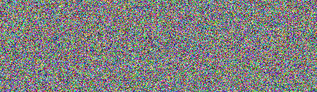

# TRABALHO REALIZADO NA SEMANA 10

## Task 1: Frequency Analysis
Após análise do texto e de bastantes tentativas de substituíção de letras por outros de modo a chegar a expressões e palavras que fizessem sentido chegamos à seguinte substituíção de letras:

```shell
$ tr ’xbytndzhciqsvreaplufgmj’ ’OFTHEYURMLSKAGPCDWNVBIQ’ < plaintext.txt > ciphertext.txt
```

Obtendo o seguinte texto desencriptado:

```
THE OSCARS TURN  ON SUNDAY WHICH SEEMS ABOUT RIGHT AFTER THIS LONG STRANGE
AWARDS TRIP THE BAGGER FEELS LIKE A NONAGENARIAN TOO

THE AWARDS RACE WAS BOOKENDED BY THE DEMISE OF HARVEY WEINSTEIN AT ITS OUTSET
AND THE APPARENT IMPLOSION OF HIS FILM COMPANY AT THE END AND IT WAS SHAPED BY
THE EMERGENCE OF METOO TIMES UP BLACKGOWN POLITICS ARMCANDY ACTIVISM AND
A NATIONAL CONVERSATION AS BRIEF AND MAD AS A FEVER DREAM ABOUT WHETHER THERE
OUGHT TO BE A PRESIDENT WINFREY THE SEASON DIDNT oUST SEEM EkTRA LONG IT WAS
EkTRA LONG BECAUSE THE OSCARS WERE MOVED TO THE FIRST WEEKEND IN MARCH TO
AVOID CONFLICTING WITH THE CLOSING CEREMONY OF THE WINTER OLYMPICS THANKS
PYEONGCHANG

ONE BIG QUESTION SURROUNDING THIS YEARS ACADEMY AWARDS IS HOW OR IF THE
CEREMONY WILL ADDRESS METOO ESPECIALLY AFTER THE GOLDEN GLOBES WHICH BECAME
A oUBILANT COMINGOUT PARTY FOR TIMES UP THE MOVEMENT SPEARHEADED BY 
POWERFUL HOLLYWOOD WOMEN WHO HELPED RAISE MILLIONS OF DOLLARS TO FIGHT SEkUAL
HARASSMENT AROUND THE COUNTRY

SIGNALING THEIR SUPPORT GOLDEN GLOBES ATTENDEES SWATHED THEMSELVES IN BLACK
SPORTED LAPEL PINS AND SOUNDED OFF ABOUT SEkIST POWER IMBALANCES FROM THE RED
CARPET AND THE STAGE ON THE AIR E WAS CALLED OUT ABOUT PAY INEQUITY AFTER
ITS FORMER ANCHOR CATT SADLER QUIT ONCE SHE LEARNED THAT SHE WAS MAKING FAR
LESS THAN A MALE COHOST AND DURING THE CEREMONY NATALIE PORTMAN TOOK A BLUNT
AND SATISFYING DIG AT THE ALLMALE ROSTER OF NOMINATED DIRECTORS HOW COULD
THAT BE TOPPED

AS IT TURNS OUT AT LEAST IN TERMS OF THE OSCARS IT PROBABLY WONT BE

WOMEN INVOLVED IN TIMES UP SAID THAT ALTHOUGH THE GLOBES SIGNIFIED THE
INITIATIVES LAUNCH THEY NEVER INTENDED IT TO BE oUST AN AWARDS SEASON
CAMPAIGN OR ONE THAT BECAME ASSOCIATED ONLY WITH REDCARPET ACTIONS INSTEAD
A SPOKESWOMAN SAID THE GROUP IS WORKING BEHIND CLOSED DOORS AND HAS SINCE
AMASSED  MILLION FOR ITS LEGAL DEFENSE FUND WHICH AFTER THE GLOBES WAS
FLOODED WITH THOUSANDS OF DONATIONS OF  OR LESS FROM PEOPLE IN SOME 
COUNTRIES


NO CALL TO WEAR BLACK GOWNS WENT OUT IN ADVANCE OF THE OSCARS THOUGH THE
MOVEMENT WILL ALMOST CERTAINLY BE REFERENCED BEFORE AND DURING THE CEREMONY 
ESPECIALLY SINCE VOCAL METOO SUPPORTERS LIKE ASHLEY oUDD LAURA DERN AND
NICOLE KIDMAN ARE SCHEDULED PRESENTERS

ANOTHER FEATURE OF THIS SEASON NO ONE REALLY KNOWS WHO IS GOING TO WIN BEST
PICTURE ARGUABLY THIS HAPPENS A LOT OF THE TIME INARGUABLY THE NAILBITER
NARRATIVE ONLY SERVES THE AWARDS HYPE MACHINE BUT OFTEN THE PEOPLE FORECASTING
THE RACE SOCALLED OSCAROLOGISTS CAN MAKE ONLY EDUCATED GUESSES

THE WAY THE ACADEMY TABULATES THE BIG WINNER DOESNT HELP IN EVERY OTHER
CATEGORY THE NOMINEE WITH THE MOST VOTES WINS BUT IN THE BEST PICTURE
CATEGORY VOTERS ARE ASKED TO LIST THEIR TOP MOVIES IN PREFERENTIAL ORDER IF A
MOVIE GETS MORE THAN  PERCENT OF THE FIRSTPLACE VOTES IT WINS WHEN NO
MOVIE MANAGES THAT THE ONE WITH THE FEWEST FIRSTPLACE VOTES IS ELIMINATED AND
ITS VOTES ARE REDISTRIBUTED TO THE MOVIES THAT GARNERED THE ELIMINATED BALLOTS
SECONDPLACE VOTES AND THIS CONTINUES UNTIL A WINNER EMERGES

IT IS ALL TERRIBLY CONFUSING BUT APPARENTLY THE CONSENSUS FAVORITE COMES OUT
AHEAD IN THE END THIS MEANS THAT ENDOFSEASON AWARDS CHATTER INVARIABLY
INVOLVES TORTURED SPECULATION ABOUT WHICH FILM WOULD MOST LIKELY BE VOTERS
SECOND OR THIRD FAVORITE AND THEN EQUALLY TORTURED CONCLUSIONS ABOUT WHICH
FILM MIGHT PREVAIL

IN  IT WAS A TOSSUP BETWEEN BOYHOOD AND THE EVENTUAL WINNER BIRDMAN
IN  WITH LOTS OF EkPERTS BETTING ON THE REVENANT OR THE BIG SHORT THE
PRIwE WENT TO SPOTLIGHT LAST YEAR NEARLY ALL THE FORECASTERS DECLARED LA
LA LAND THE PRESUMPTIVE WINNER AND FOR TWO AND A HALF MINUTES THEY WERE
CORRECT BEFORE AN ENVELOPE SNAFU WAS REVEALED AND THE RIGHTFUL WINNER
MOONLIGHT WAS CROWNED

THIS YEAR AWARDS WATCHERS ARE UNEQUALLY DIVIDED BETWEEN THREE BILLBOARDS
OUTSIDE EBBING MISSOURI THE FAVORITE AND THE SHAPE OF WATER WHICH IS
THE BAGGERS PREDICTION WITH A FEW FORECASTING A HAIL MARY WIN FOR GET OUT

BUT ALL OF THOSE FILMS HAVE HISTORICAL OSCARVOTING PATTERNS AGAINST THEM THE
SHAPE OF WATER HAS  NOMINATIONS MORE THAN ANY OTHER FILM AND WAS ALSO
NAMED THE YEARS BEST BY THE PRODUCERS AND DIRECTORS GUILDS YET IT WAS NOT
NOMINATED FOR A SCREEN ACTORS GUILD AWARD FOR BEST ENSEMBLE AND NO FILM HAS
WON BEST PICTURE WITHOUT PREVIOUSLY LANDING AT LEAST THE ACTORS NOMINATION
SINCE BRAVEHEART IN  THIS YEAR THE BEST ENSEMBLE SAG ENDED UP GOING TO
THREE BILLBOARDS WHICH IS SIGNIFICANT BECAUSE ACTORS MAKE UP THE ACADEMYS
LARGEST BRANCH THAT FILM WHILE DIVISIVE ALSO WON THE BEST DRAMA GOLDEN GLOBE
AND THE BAFTA BUT ITS FILMMAKER MARTIN MCDONAGH WAS NOT NOMINATED FOR BEST
DIRECTOR AND APART FROM ARGO MOVIES THAT LAND BEST PICTURE WITHOUT ALSO
EARNING BEST DIRECTOR NOMINATIONS ARE FEW AND FAR BETWEEN
```

## Task 2: Encryption using Different Ciphers and Modes
Usamos 3 modos de encriptação:
- aes-128-cbc
- bf-cbc
- aes-128-cfb

Para encriptar e depois desencriptar com o primeiro modo corremos:

```shell
openssl enc -aes-128-cbc  -e  -in plaintext.txt -out cipher1.bin -K  00112233445566778889aabbccddeeff -iv 0102030405060708
openssl enc -aes-128-cbc  -d  -in cipher1.bin -K  00112233445566778889aabbccddeeff -iv 0102030405060708
```

Como exemplo texto encriptado obtemos o seguinte (para os seguintes não iremos meter para não encher o logbook com coisas desnecessárias):

```
UF\8B5\E7ފ\AFɠ1\F0\95\D3!\A9\BB\FB|\B8\E8+\B6Վ\E8\D8s\884@\A4\852tN6K\A3l\F28r\82\DC\A4A)\E8\B4֮\DAͅVt\F7\ABǤ\BE\F7\92(/\84p\EB\80nD\D4\EF\F9\A1~\90|\9C\B5!\C9\D9vcl\BC\96\FF,{Ѐ\A7\D7FYo\E4G\C2o\AFfAt\E2یڃO\A9h\C9\E9\F7j!^%J\B7Kf\C2\FB`\C2\EBT\FB\ABO\82,x\D7D4\FA\C8O\AD\B7\A2\90\FAF\A9\86\90\DB*\A6c"\E0\84LK<ÄpW\BF;ד\80\FF\8B\C2o\A8\AE\E9\8D*\BD\ADh\D4\AB\DC\C7^X4\F3.\DF\B2\AB\B0\A0tM~\F4\8C\88#\DEj\A2w\8E\95\D3\C9\\B5\80\B5\C4M\AAw\F9\A6\B4\B9\8F!c\A2\8F\ADTL\B5d\9C\BD\C8x \EBF\E5~\A8y.\FA3ݏ\BDDU
\99Gc<q<掝\AE*\DBF^\CBY\94\CE\C8\C0\F2\ACm\D5G\8F\91\83\C5U\A0\E5>\E2\C3k\EEIxnb2\C9\D4n\E2\A6	\8E\C0\AD\8F\C4\973@Yo\FE\F4q\B09\8B\AB\92d\F8\91\E81\C2\EC\F3=\AB\BBkp˟\8F! F&#\A1\C3U\9E\B7\89\A5\B7\FE\BB\BC\C0\EA$
\E2\D8%pT\8A\CC\EF*\CA=ݪ,\920h\AEH\CCL\ED|\BE9p:\91Qs\81G\B7/\E1\93LIv\D7\00\F4\00p\C7\D15\9B\D3.\F1%)\ABP\9D\88\B7\FA$\F3\F1\D7u\FAz8\C0Ԏ\FAY\B0w\DC\99.;\BF1m\F2~u4\AB\87bw\C4ŤF*7\F8\DA\E4\E5!v\FC\89Ӳ)\8F\DB\E2\ABX\EA\B9mw\F4\E0`\EB\FB\F8\8E\F6\8E\E0"H\95
 7\DFT<5\B7\E6Y\E4r\A0\C8\FD\8A\9F\F08{aB\D7J\A8H\DCFqO\FE\D9P\ED\B7)o|
\92
1""<\FF\A5G)\A4\91i
\CFQ?\A3|\97\A0*\B7\9D\B8\9E !\EC\FC\DF
Alةl\EB\8F_\AAca\9D\BCr\C1\D6nX6[<)Q\ED\D4\C4S\CD\C4՟\E6"S\A5\D9S\BBɾ\95\C6ӊ5\FE.\8F\ECL\EF\E9$TkCƾ|)\BC$L\CF\E1X\B6!\DB\D8\C5M\8FMyB\D2Ӥjubnk(\8D\C8(!\84_\F8\A9\BE[03\A6Y\A3D\BA\82\BB˦&\DC	bG\EFeO\89\98	\E2˸c:R.
\A4M\F0ů\AC\87\D9S\FE\A32\E7+&\FE@\CA?\92#\A4F:m\C0VY\D6\9C_X<`[ \E5\D4\00\8F\85u\9FI\93\F87\B5A\9Aåcg7\00\9CA\F9\EBjMn\CEEW\F9\C1\94\00!b\ED\EBp\B0&\BFr\A3\C9s\DD\F0y\88\F0<:\EF$\E2)F~\C4\C35<z\E0C\CD5\AC\99\BD\CE\E0\D6\F7\EA\ACD(\88\96k\B4\D04\A8P^\EF\A4\ACl\D5a\A2\D9d\DEhm\E5'?o\9Bn\DD\DE.\84\F7\B0\C0\EFfҡ\CEL$\AB)\97!q\88H깼}\AC\BDCT\9F\E2\97\F9\83\E6O\F0s\82\A1\C1\FCᇊ/\FA\BF!PCSv5\A7-\AD\9Fvș[\90\F0/Ιrm7\AF\BB\EB\A1\C4_*ϥ\DCœ\FA׃p\F8\E82t\E0wۡ0sW%\F9؄\CF{w\E7\AD"\A7fc\81Дp\E2\ECu\CB]2k~\8C\A6\E0
\ADe߶\EE
\BBv/\DCEOB'\ECT­\E6\83Q@\82\F6\F0)\99\A8\FDz\8E\A9M~\B7\B3\ED+\BC"mBIp\FD(qA\C7tp_\B0,\96y_\A1:\E8n\C2B\E0\B54FP\87*P\A3\CC\C9\D2@\00\9C`\D3l\F0ӠN.`\F1\AC\ECg\A0Y\EE\F4[K0泇\F9\EFV#\AB\C9*s\ACF*\BFBl{\E4\F2:ɨr\EC`?ԐtA\D0K\C1IsW\CA\D4\F3%\87\C8'\9Bd>F\91\88\E0}\FB橋0\8CZw\CC(\BB\A6\EBT\B3>\C4t3\EBH\86F\8A\EB\B5GK\B8\FE\9CԊ\F7Ī\F9\EBv\BE\E3^s\86\CEm\F6.
\F4\86\F00C\9ANj)\9FB\87B66n܇{\B7ȨD\F5\DCe\879\8Dl\A3W\89bAbI\ED9\CEr\8F\CE\C9\CE\E3J\A4\C0rE:P\DB;_"ZAm04\81\BAG3
\970\D0.\\E2V\84\9D)w2E\F6\B2\E3\EB\AB\C2\F1\BCC\AA\8D\B5\E2\EEh\93\9C\D4~C\C4W-\DE\E0/\E8\9EV\CFT\9AQ\FF%\E79TbP?0\CDC\83o\9A\D0݋_I\F9\DBm\FA/K\D1d&\C70nQ)\90W\B5\C8R\A7\C2P\E7\ED\BB&\F4\F7.\BDy\8DIR1
\C4\C0\FC\D6r\ED-\9A\A7\84D5\BAZ\96hs\B53\C4	\AE:\AEh\96sz\DF\
\82\F5\D7x\96p	\A61q\A2t\8A\B1Ԣn.\F3"\E1\83\BB^\B7c\A3[!\84>\A7\A0ޘ\CD*BpΟ\D4)~\A5L\ED\H\88{\83׋_\9A\E0\9B\8D\AAEˏ\B5\F09Vm\F0,E\EDQ\8D\A8\AD\E4+EBG\9D;\E4\A21K\9B\B9\00\BE\A7\C4o\86vuܴ<\95\8Cu\00Z\AF\BF\AA\B3Z\95(#F\EF+\E7S\B6U\D5YC\94\A3\C4J.\AEu\F2\E3\99\FAp\CF]\93š\A3Q\AF|\DDE\BAr\BBv\9A+vbP^\F3\87\96\BF+\8C$uO	[y\BA:\C6Y\DFħ\853\D9\E2z\A5M\D6T=\A1\BDgIbɃ\D1
Q\FEp$
D\9A*\A8\AD)Y\9B$x(v\E1\9CY<\81\E0\88*\E1\8E1~\9E\FDI\F5\AEAt\D7~\F8b\E8>t\A1\A2\D4\DEժ|t\EBgs\D7E\97\AAۙy9\B73r|^\E7)\AD#E*\EF8\E6) \F6t\DF8\8E)\93,\CE\FFu\AA\A6E	\B9\8CW\A2k}\D0\D3\00D\AFfR3I\E6J\F6\F9\FC\84\A6\91&\9F\A1K?\B87y\E3\EB\976::\85\Y\89+\F7`1l\B9\FB\DFvsX\8B\E7!\8A\BC\868|\A8>\87FC\B5n+\DBD\CF1\96\8C41\A7\EA\93o\D2Q3\BC\FBj]\E4̝=\E9_\AD\B9/º7{\BDPm\A8Z\95OkV\CC\CD\DEt:V8\93\BE=j8l\D9a-\9A\F6\ED8\95n\"\D0F\8FS\B2\E1L\8E\AAC\D0'Ț\C1\A5\B169\96$\CFE\AB\D7\E6x\A1Y\F6\F6\CB\DCJ\F33rZvXh\97Y\B3M\ECuZW\C0\8A\F4 \85\A9\CB"
\87\A9\C7'Q\97\D6\DA/\99\E3~(\EDE*\E6@`x!\A6\D3G`\A5\A2&2%8lv\FEEn\D4#e\F9\B6\A5\A5\FF\F3L\F4<Z\DC\D2>.\87-\F1b
\F7ξ\K]\B0\00\00\C0]\E6z\B8\FE\FA^\CE+\9D\E6y\DA%A>\CBs\E3\B6\C0\93\9DO=\E0L\FD\D2\9DJ\EF\CE\D4e\AC\EE-2G^\90퉚\D7tz\E12i\B7hp\94Y\E0_\9D\A0#Kb\DF~\8C*g\A3\D8\D9s\9D3jVtY\96j\8F\A6\93\BA\9A\924\93P\D4?\A0ܤN7\94O\E8\D9}߰\B9\91L2\F5\93\C2klN\EA\D4 \98\B4]\B3\E4\FF\D2<\93\90\A8\AE\A0\EF\CF\CD	-\A3\A4\FAݩ\ACa\8B\A9\CE*\9F\AD\E7A\88\F5V\9CÙH\D6\C0\9Fc\F3\E2x\F9\CCb~:\D3Q{\B0\E4\B1\98\D2\DF\FA\B0b\C02\AC#V\BBM:\B0b\AC\BA\9D\D6C\F9h^i\E6.\B1\8912=`i\00\92f	9(\D2F\D7\C0\00
E\8E\8D&Y\BE\A8\E8\ED B\D7\C6I\B2\EC_hS}\96\CD󹝤MQ\F9\B2O\E7&\EE\DEI\9A\00\F1\F7G\E7\A3,\B2d\E3sςmjV\85\D1\94;\A5\87\D3\DA	\A9Ǐ\B1\84S-\DB}\AF(m+1b\92:"p=P\DA)e0	n\EE\B5z\99U\A4\F3Z\BF\C9
\E1:\E75jTs7G\AE\82_\C0`
\EC\83>LRR\CB\C0y\E5\E0[5n+\C3\E4\A7I\B8\EE\E6\A5\E3\CE\F2\D5f:>\9E
A\EE\E5\B9ϛ\C39̖9ҝOlI\D9B\B1\917\94{~k"\CAOӿ\D3k/\A44\F4\C3yr}\BDΜ\F3\9F4f0\D2K
m\9C\80\CB\003\92\86\9Bf\B2\CB\FA\F8\CB\E4yH
\9D\AFc\CCYp?\80O\F1+\A7\D2z\ADڭ\F9\95\9B\DDi\C6\C4
\9Ff:ۙ+ٹK4Q\94L^X\97g\84\E8uVo\B2}\E9Z\E1\D8P\D0\D9kL\C9v\E3>뮷\87"\81*\89?A\A5\EB'\A6\B0\C3=\B2\EA\8D\C0M\96\EA\E4Z`\B7\CE.\C5t\C1	\FB\85\A1zEA\87\A4\D02\B3都ۼ\AD\8Clܡ\A3\98H~\A4b\DBȌ\CC=\9D\B1Ov\F9n|\BD\A6,n\B0\B2\F65FzRv\92)\98\B8\D7`!Z\96(}Ɗ\84\EF2\9Ee,\9B\CEH\B82\B2\F4\B2s\D9fwQ\93;\F7gC6e\F3c\82\FD!|\8DFk\C4Q|I\EE\DA@sB\C3^"Ы\AC\D7`WV\D30Ln\B5ʌv\EA/\C2\E3L\E0\C1\A7\FE\C4e\8A\EEz-E\C2I\81\90\CFh\CBP\A8\C4"\B5\DB\DA\F9\A4\9D\DA|t\9A\FD\A5\9D\83\E8\E4g\A4\AB\86\BD\ED[\F0<1\BE}Kz\83(K\F2U[\D5\ED\B2|.6\8F\D6\D7\DC%\C1$\E9,l\FB\83\91\BAn\91\B3^')\9FJ\9A\DD\BB\90\ED\FD\93\B13#\A1[\C0\AF\AC\C0\8D6.e-i\AF\95\C6!\DFž\EF\A5y
y\83\911\A2\DF\F8\CC\EAP\CD\B7NS\83I\B5\CBc5c1:HGp\F6\F2\ABJ(>\BC+_\\E6^YUR\D5֦N\8E\AB\EEkG\F7\99b\EB\F8P)]}ߐ\A5\BF^\94\9A,\D6Pi\C3\DD\FA|~c\B8\E3\EB㌿\8C\EB\D3bzS2\94\FCÒ]\B8\89\DD\E6\D9R\D9"=\B39\AB,r\F0\FAB{\86rBL^\D3L_t\A0\FB\D0|\F7\B5⸆\B3\E2\DAgY\FB6\8FW.\87\9F\E6=\F0\E6(Rﴘ_ޑ\CF%\F9\C0\84\E4\97\D9\C9\F6\9B=p\9F6\CD\E3v\99\\9A\D2\8F\D7c\F98W\DC\F4\E8\A44>\F6\F0K\D0G\D4et\D9W\DD\D5e\C2\EF\FF=\00\C7(\90\BD\C4{!\9B\E32À\B77\C87Ћ\A1z\D1\E1ٱd\AE\82uM\B6;.\B7\80\CA\EF\AB\BE4rf\93"\AEV\F3\B5\F3\F6\C6Mt}"\F3\9B\F2\B4\FB\E6\DBh§2u\9E\853\AC-#2EW+\ABU\93\C5%C7N\ED("\C69\A5\85\8E\80Ԁ\A8\83\B3\B4*\D9\E6Q\F6pJ
&f}\B9\B7U\D7\B6)|\F9\BBU`\C01\C2\F0\E1\C0\CB\CB\D3O\DE,\CBj\ED嶯\E6w\8C&\8E3]9>m$\9C\FD%\A9o3"\ADz\D6\EB\9EqS\DB\ED\87\FBqGa\AB\8A\F5\AA\DBͷp\8D<u\BB7\8Alq\00x\8B\8E\E81N\D7M\CE.C\95\A0s\B7S\B4:\D3
\F1&\B56K£\B7N2\86\8D\D8\CES\AAR\90\A5\D6wE\92\95Oׁ~\FC\DC\EE\8Cۛ\EELA\B45\C6\89\DC[\D5\F2\AA\C1\EA\A6۲\A6\99\D9\8F\A0\DC!\BE\AE8\A6W\FA\F6O\D2}\90$\FCC;\8Fz\B2\B7\98\E7 \9B\8E\E6w\FAz\E9\F4\8E\E4u`\99\CCR\DF4\BE\E3\A5\EEld\CA\98\C3~CIS\D8!1\E0O\F0\80\86)\BB\B1L1\A4\B5?j\A1>\F3\86\C9;ģ\E8\DF\DC
\80\8CY<2	]\C0H\D1W̹\F1\899<\AA't\EB(\8C]NJ\A2w\E5\9EM-\94A\C4_܊\94aj׻\83\B5WX\C9~\B2\A8@qx\8C\9B\AD\D8+\FE\C5lK\C1=\D2Dr\FD)\95kz\ACq\A3Ӑ\E5\DEJp\AB0nz\9Ci\C9\DC\F4\90\97h\C4V\82\DE\DBEa<\D4\FE^\C0{\A5\87\A9\F4\B6\B2\FF7\82N\C1@\ADv\DF\FC\E0l\8E\96\86\A5$3\C8\CE\CB\87أ}S@x\F1Q\9Bm\AF\C1\00\F31B\CE\F0D|\A9\B5\F5]#\99ɏ\E1U;\8A\C1\B9=\EB}\92tSߔ\9DJ\AE\FD\B5\AD󋷍\A4\C6k\F1p?\9A.\97\FF\8DD\94\AFsn\82(+kTbH\95\9B\96Z}\B3\B4\D2\@\D1s9ҿ\BDۿ\97\C8a\8E:\DB\D5\DDc\BD4g\86\DE\EF:\A6b&\E8ԣI\A5&\E1\DBI-إoi1\96\97\A7d\ADKQ\A9X\9F%!\82ۆ旿\A1\E6\B1
,ݕ\FCR׆\E5ۛX\9C\B2\CC(\9CcՇ\A5(\C9\E6ҞEŦ\C9Y\9E\D5[\A7\D0Ma\8Avo\9C\8D\DE\00\F2\B5\9AP\D7c\9D\A5\E87\92\AF\A4\A2h6\B7nA\DEa\9E`\F5)2\C1({\A5\F7\B4ݩ5\A0\AD\A2\DA|+\D7Z'7\FD·\F2\81\9Eڭ\BE\AF\E3\94\E9\F5\A1\CF\DE\CB\E0Kb\96%]z\D2b\B4˸\AA5\BA'0\\B6\DF\CE)\E7G;\89\99[=\EC\A5
\B6\B8d$\CD\F9,\9B=	UK\F9\91\BF\F8\DB2zA\9D\DFS\A2\A4v\BAs\E3J\C8\D11\92\DD\EE\C4o\B9\E7\A6׽H\C4	u\E6\E7Z,\FA\E6:\D3ABh5\8C\B2αV\BE\83\8F\ED\EA\86;\B9_\82qr}E\E5\8B\AEO\BA\A7\EE\C6˴\86#\F0\E7i\91\D1z\C9Ч\DD;\AC\B2\CFw9Ɔ\CD\EA\D39x\BB\D0L)F\99\8F\F9\D3,C\B5˟\B6\F7А\9F\C2=\F8:\921Qg\E4Ƃ\82\D4	ޔ
\82/w\91ޯm.\D6\EFmgɑ7$\94\B2\90\E1\CFБ́\ACu\FEF&\D6\F1\BA;٪\FD\E0\91\F3F\81\F2
}`6I2709N\97\9E\91o1T\D8\A6WWz\F1\BA\9A)mG\900d\BCu=\B6\A8\DDԩG\D5
6K\ABf\D9:\ADU\FE#\91\89Z\A5\87#\ED\E8Z\BE\B4^c\ACY\ACI\AF]\FE,\E3^\81[\F4D#\85,G\E1?joXzE\F2[=\F4\90\C3ԣߵ\BFc\9B\88\BA(\F8\ED\CCx\AD\D0(d\EF\F8~m\88łJd\83\B9\CB;\8F\FA\B9g_\B0=͆\A6.lF7\82\B3L\C4t\C5\CF%\E1z5\BE\E8\BA\82e\B01\90b\E8\C2~*\97\AD\D8\C4P\E5b="3\B6\B8\F8kQ8"\AC\CA\D3>\93\C9\DF]0	\FE5z\F7\89\96aD\F0L:\99\E6\FA[\99HT-z\B4\99\D5\E6\A1\98HUB\FAǛ\B4L\B8\E4	\A6\C7\CE޷\96\B47\9A\98\ED\B3V\9E\D0@P\A4!\BF\B5	\91c~F\83EV\D9GB,a8\B2k\9D\FF\AC\C7%\80x\82\BB
_\D7݇K\AE\E9j:+V=\AFj\8C.\E0\F1Ny\D5!\BE4\D3L\84\C70\CFl\907\9Dd_L\D4l\EB\C7\F9\F2\EF\F6\C3\C6-]\E1\CBf\81\A4F\82\99\B8\CB\D0\C2\E4\8BYK\F17\A4\97\CAѩYK\B0\C1oV\C8ƃmj\AD\A9\C4\E6\Q\93D\A0\FB8\B3i~4f\B2/
```
Para encriptar e depois desencriptar com o segundo modo corremos:

```shell
openssl enc -bf-cbc -e  -in plaintext.txt -out cipher2.bin -K  00112233445566778889aabbccddeeff -iv 0102030405060708
openssl enc -bf-cbc  -d  -in cipher2.bin -K  00112233445566778889aabbccddeeff -iv 0102030405060708
```

Para encriptar e depois desencriptar com o terceiro modo corremos:

```shell
openssl enc -aes-128-cfb  -e  -in plaintext.txt -out cipher3.bin -K  00112233445566778889aabbccddeeff -iv 0102030405060708
openssl enc -aes-128-cfb  -d  -in cipher3.bin -K  00112233445566778889aabbccddeeff -iv 0102030405060708
```

## Task 3: Encryption Mode – ECB vs. CBC
Inicialmente usamos os algoritmos cbc e ecb na *pic_original.bmp* com os seguintes comandos:
```shell
openssl enc -aes-128-cbc  -e  -in pic_original.bmp -out cbc.bmp -K  00112233445566778889aabbccddeeff -iv 0102030405060708 # usar cbc na imagem
openssl enc -aes-128-ecb  -e  -in pic_original.bmp -out ecb.bmp -K  00112233445566778889aabbccddeeff -iv 0102030405060708 # usar ecb na imagem

head -c 54 pic_original.bmp  > header
tail -c +55 cbc.bmp > body1
tail -c +55 ecb.bmp > body2
cat header body1 > cbc_v2.bmp
cat header body2 > ecb_v2.bmp
```

Tendo obtido as seguintes imagens:

<div style="text-align: center;">


**<p>Resultado do ECB</p>**

</div>

<div style="text-align: center;">


**<p>Resultado do CBC</p>**

</div>


Ao ver as imagens resultantes após a sua cifra podemos ver claramente que o método de encriptação do ECB não cifra corretamente a imagem, pois ainda que se veja que a imagem foi cifrada, dá para entender em parte o conteúdo da imagem original antes da cifra, pois este método cifrou a imagem aos blocos pequenos. Pelo contrário, quando cifrada com o método CBC, a imagem cifrada não deixa passar qualquer tipo de informação da imagem original, obtendo assim um bom resultado de cifra.

A principal diferença entre o BCE e o CBC é que o BCE criptografa cada bloco de forma independente, enquanto o CBC criptografa cada bloco com o bloco anterior. O CBC é, portanto, considerado mais seguro e resistente a ataques de reconhecimento de padrões do que o BCE.


## CTF : WEAK ENCRYPTION


Por análise ao código do ficheiro fornecido entendemos que as seguintes funções são utilizadas para:

-gen() : gerar a key para a encriptação no modo counter AES;

-enc(k, m, nonce) : encriptar e mensagem 'm' de acordo com a key 'k' e nonce 'nonce'

-dec(k, c, nonce) : decriptar a mensagem encriptada 'c' de acordo com a key 'k' e nonce 'nonce'

Por análise, podemos verificar também que a geração da key é feita através de um array de bytes inicializado com 13 bytes a zeros mais 3 bytes com valor aleatório nas últimas 3 posições. O que possibilita a geração 16777216 possíveis chaves. 

Tendo em conta o número total de possibilidades, consideramos que esta era uma vulnerabilidade na geração de chaves para encriptação.

Como já é fornecido o nonce quando acedemos à ligação em "ctf-fsi.fe.up.pt 6003", basta saber a key para decriptar a mensagem também recebida quando feito o acesso ao servidor.

Devido a isto construimos um algoritmo brute-force para tentar todas as possíveis chaves de encriptação e verificar se a mensagem decriptada resultante era do tipo "flag{xxxxxxxx})".


Após correr o algoritmo conseguimos então visualizar a mensagem decriptada.


