# TRABALHO REALIZADO NA SEMANA 11

## Setup
Inicialmente adicionamos a entrada : '10.9.0.80 www.bank32.com' nos hosts da máquina virtual e abrimos um novo terminal com acesso ao container
```
$ sudo nano etc/hosts # Executámos este comando no dirétorio base da máquina

# Corremos os próximos comandos no diretório onde estiver o ficheiro docker-compose.yml

$ dcbuild 
$ dcup
```

## Task 1 - Becoming a Certificate Authority (CA)

Começamos por copiar o ficheiro de certificado default que está no diretório /usr/lib/ssl/openssl.cnf para o diretório atual. Depois descomentamos a linha "unique_subject", e executámos estes comandos para criar o ambiente da nossa CA:

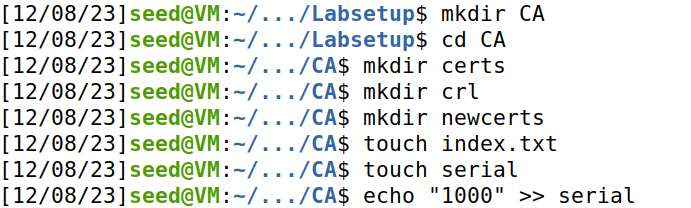

Depois começamos o setup da CA e colocámos os dados:

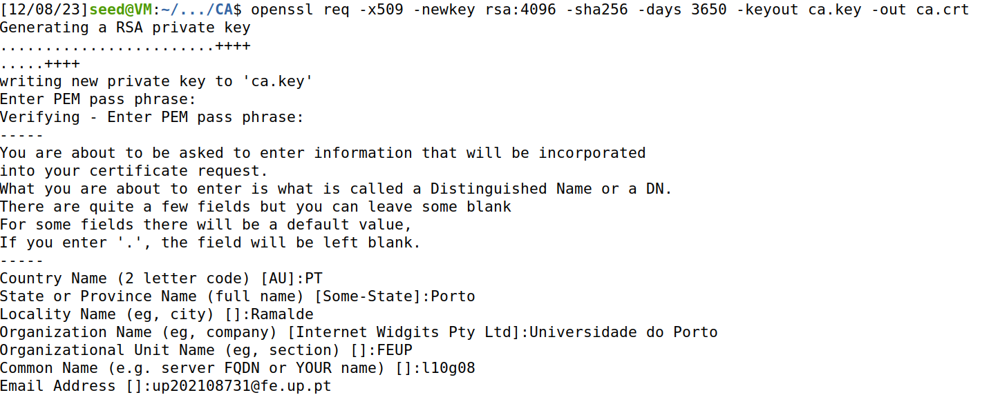

Para ver o conteúdo dos ficheiros, corremos a seguinte linha:

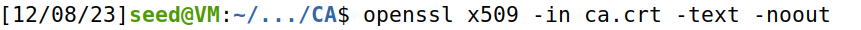

Conseguimos perceber que é um CA já que temos na secção basic constraints este atributo verdadeiro:

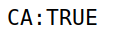

O CA é self-signed já que o campo subject e o campo issuer dispoem da mesmas informações:

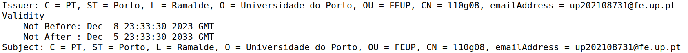

Finalmente corremos este comando para visualizar os elementos referentes à criptografia:

```
$ sudo nano etc/hosts # Executámos este comando no dirétorio base da máquina
```

Gerámos um documento com os elementos prime1, prime2, modulus, publicExponent, privateExponent e coeficient, diponíveis neste [documento](images/CA_STUFF.txt)


## Task 2 - Generating a Certificate Request for Your Web Server

Para esta tarefa tivemos de gerar um pedido de certificado para o website www.bank32.com
que fizemos através do seguinte comando:

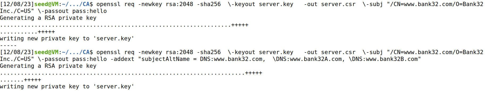

## Task 3 - Generating a Certificate for your server

Para gerar agora um certificado para o nosso www.bank32.com foi necessário executar o comando abaixo:

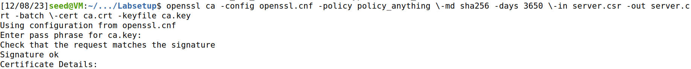

Com isto obtivemos o ficheiro do certificado do website:

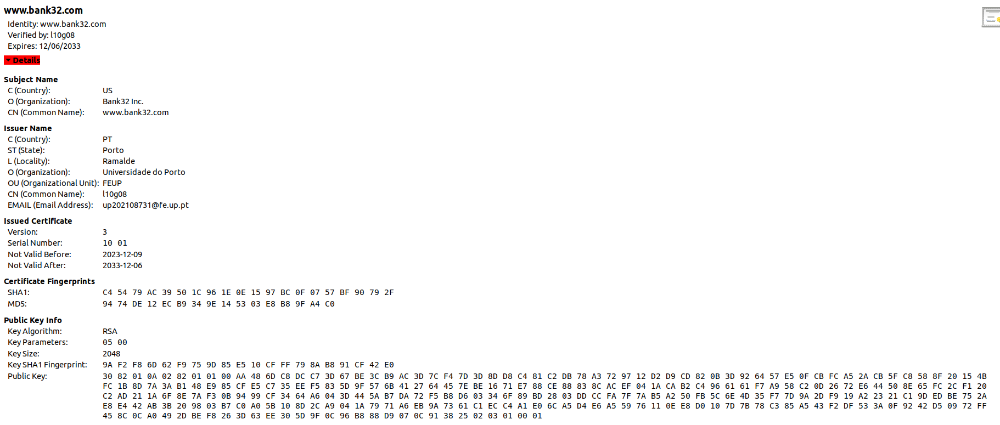
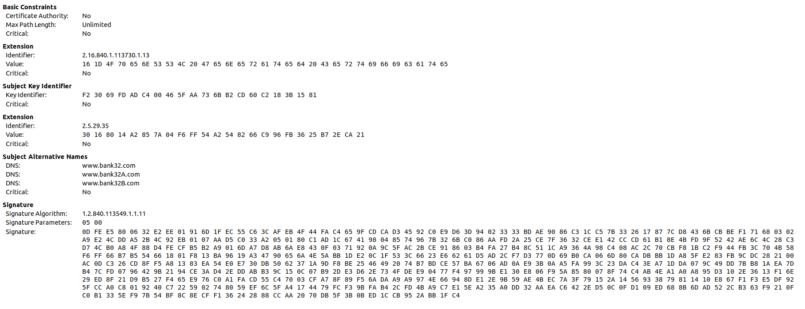

Conseguimos perceber que o certificado abrangia todos os domínios colocados anteriormente, descomentando a linha "copy_extensions = copy" e correndo o seguinte comando:

```
$ openssl x509 -in server.crt -text -noout
```

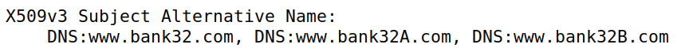

## Task 4 - Deploying Certificate in an Apache-Based HTTPS Website

Para iniciar esta task nós copiamos os ficheiros server com extensão .crt e .key para a pasta partilhada com o container (/volumes) e mudamos os nomes para bank32, mantendo a mesma extensão. Alterámos também o ficheiro "bank32_apache_ssl.conf" contido no diretório:  "etc/apache2/sites-available", com o objetivo do certificado e a chave serem os que tem na pasta /volumes. Podemos verificar isso abaixo:

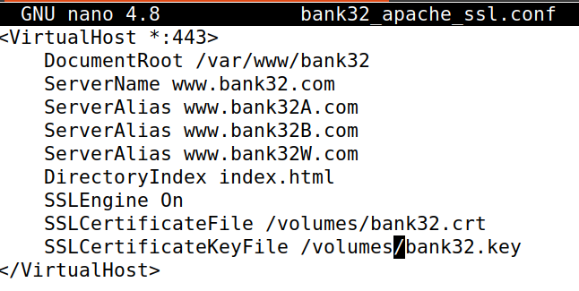

Começamos por abrir um terminal no container com o objetivo de iniciar o servidor apache
e corremos a seguinte linha para o iniciar:

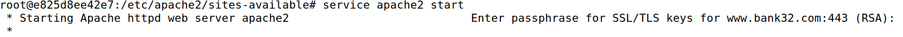

Acedemos de seguida ao site e verificámos que a ligação era insegura:

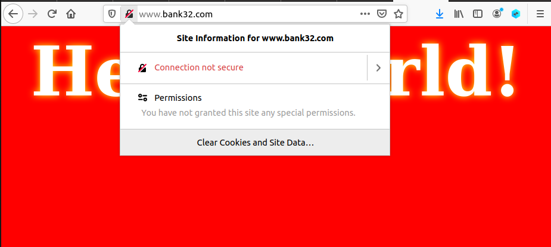

Para tornar a nossa ligação segura tivemos de aceder à página "about:preferences#privacy" do firefox e adicionar o nosso certificado à lista de certificados reconhecidos:

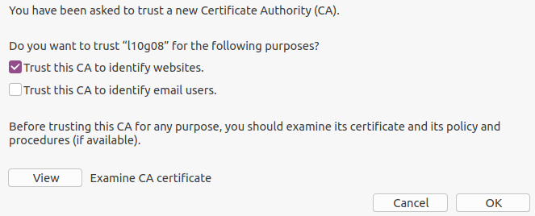

Depois de dar refresh pudemos verificar que a ligação agora encontrava-se segura:

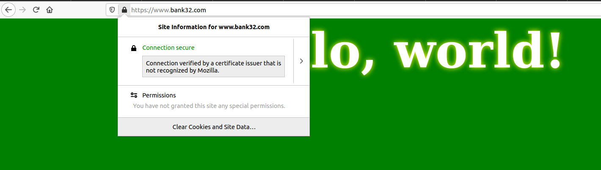

## Task 5 - Launching a Man-In-The-Middle Attack

Alteramos a configuração inicial do servidor para apresentar o website "www.example.com" com as mesmas configurações anteriores.
Adicionámos uma entrada nova aos hosts também com o objetivo de Modificamos ligar o hostname "www.example.com" ao IP do webserver malicioso (10.9.0.80).
Ao dar restart ao servidor e navegar para o website "www.example.com" verificamos que a ligação mais uma vez volta a não ser segura.


Esta insegurança deve-se à diferença do certificado usado, já que o nome do dominio não é o mesmo do que está no certificado do servidor.

## Task 6 - Launching a Man-In-The-Middle Attack with a Compromised CA

Nesta task vamos criar um certificado para um site malicioso com o nosso CA comprometido. 
Neste caso queremos criar um certificado para o site "www.example.com" e por isso vamos executar os comandos necessários para criar o mesmo, já utilizados anteriormente:

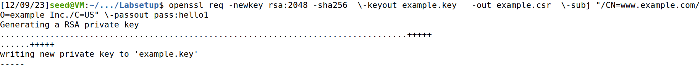
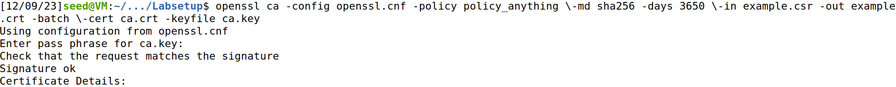

Temos também de alterar o bank32_apache_ssl.conf novamente para agora usar os dois novos ficheiros criados, a key (server.key) e o certificado (server.cert).
Depois de fazer isto, finalmente, ao dar refresh à página conseguimos perceber que agora a ligação já é segura:

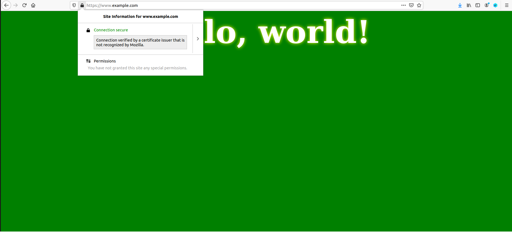
