# TRABALHO REALIZADO NA SEMANA 13

# Seed Labs - Packet Sniffing and Spoofing

O objetivo deste laboratório era compreender as seguintes ameaças à comunicação em rede:
- Packet Sniffing ( prática de detetar e avaliar os dados enviados através de uma rede, cuja ferramenta mais popular para o fazer é o Wireshark )
- Spoofing ( criação de pacotes do Protocolo Internet (IP) com um endereço de origem modificado, de modo a ocultar a identidade do remetente ou a fazer-se passar por outro sistema informático, frequentemente utilizada em ataques de Man-in-the-middle )

## Setup

Antes de passarmos às tarefas propriamente ditas, tivemos de configurar corretamente o nosso ambiente. Tivemos de utilizar três máquinas que estavam ligadas à mesma LAN, o Attacker, o HostA e o HostB.

Todos os ataques foram realizados na máquina do attacker, enquanto os outros dois foram apenas representados pelas máquinas dos utilizadores.

Felizmente, o guia fornecia um ficheiro docker-compose.yml que criava os containers necessários, bem como a rede que os ligava. O prefixo IP para essa rede era 10.9.0.0/24.

Adicionalmente, o guia pediu-nos para procurar o nome da interface de rede correspondente na nossa máquina virtual, uma vez que iríamos precisar dela para os programas que iríamos escrever. Fizemos isso executando o comando ifconfig.

Depois de configurar os contentores, corremos o ifconfig. O guia especificava que o endereço IP atribuído à nossa máquina virtual era 10.9.0.1, por isso procurámos por ele. Felizmente para nós, não tivemos que procurar muito, porque foi a primeira entrada produzida pelo comando:

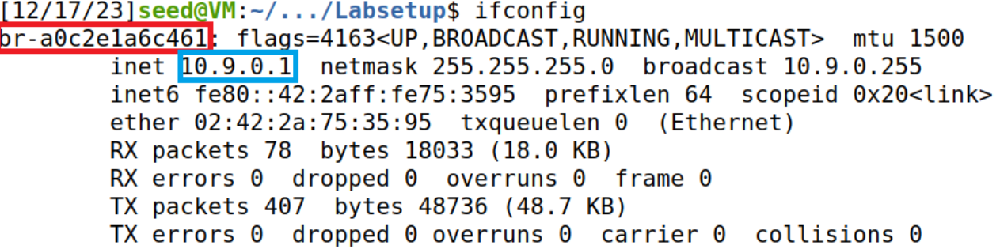

Encontrámos o nome da nossa interface de rede: br-a0c2e1a6c461. Com isso, pudemos passar para as tarefas.

## Task 1.1 - Sniffing Packets

A nossa primeira tarefa foi detetar os pacotes na nossa interface de rede. Para isso, usámos o seguinte programa Python fornecido pelo guia:

```
#!/usr/bin/env python3
from scapy.all import *

def print_pkt(pkt):
    pkt.show()

pkt = sniff(iface='br-a0c2e1a6c461', filter='icmp', prn=print_pkt)
```

O parâmetro "iface" estabelecia a interface de rede que queríamos detetar, por isso preenchemo-lo com o nome que descobrimos anteriormente.

É importante notar também que, no programa acima, para cada pacote, a função de retorno de chamada "print_pkt()" foi invocada, o que significa que não tivemos de a chamar explicitamente.

## 1.1A - Changing the priviliges

A nossa tarefa era executar este script duas vezes: uma com o privilégio de root e outra sem ele. Como tal, colocámos o script num novo ficheiro - "sniffer.py" - e tornámo-lo executável para o podermos reutilizar.

```
$ chmod a+x sniffer.py
```

Para testar se podíamos detetar pacotes, tínhamos primeiro de enviar alguns através da rede. Para isso, usámos o comando ping que é um comando do Linux usado para verificar a conetividade de rede entre dois sistemas, que podem ser dois hosts ou um host e um servidor.

Optámos por enviar o comando ping no anfitrião A para comunicar com o anfitrião B da seguinte forma:

```
$ ping 10.9.0.6
```

Quando havia privilégio de root os pacotes eram detetados:

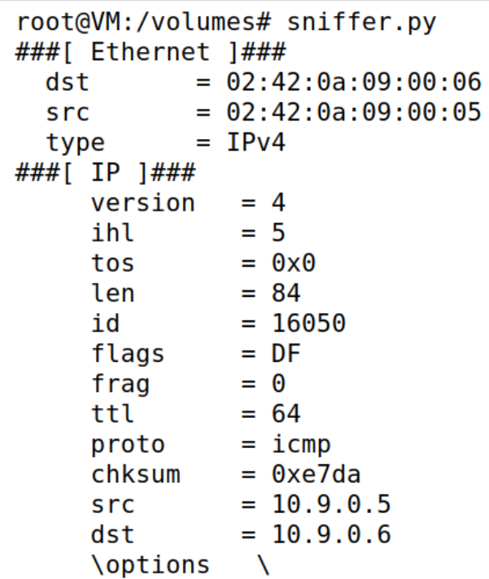

E quando não havia os pacotes não foram detectados, porque esta operação requer privilégios elevados:

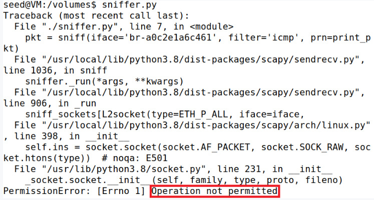

## 1.1B - Filtering packets

Em seguida, tivemos que alterar nosso script Python para capturar apenas tipos específicos de pacotes. Resumindo, tivemos de filtrar os pacotes que detetámos.

Analisando o nosso script atual, percebemos que havia um parâmetro - filter - concebido especificamente para filtrar os pacotes.

```
#                            here ----v
pkt = sniff(iface='br-a0c2e1a6c461', filter='icmp', prn=print_pkt)
```

De acordo com o guia, o filtro do Scapy usava a sintaxe BFP (Berkeley Packet Filter), então tivemos que aprendê-la antes de prosseguir.

Para capturar apenas o pacote ICMP usámos o seguinte comando:

```
filter = 'icmp'
pkt = sniff(iface='br-a0c2e1a6c461', filter=filter, prn=print_pkt)
```

O filtro icmp fez com que apenas os pacotes com o protocolo ICMP fossem capturados.

Para capturar qualquer pacote TCP proveniente de um determinado IP e com uma porta de destino número 23 usámos o seguinte comando:

```
filter = 'tcp and src host 10.9.0.5 and dst port 23'
pkt = sniff(iface='br-a0c2e1a6c461', filter=filter, prn=print_pkt)
```

O tcp no filtro forçou o Scapy a capturar apenas pacotes TCP. A parte src host 10.9.0.5 garantiu que apenas os pacotes vindos do IP 10.9.0.5 - host A - fossem detectados. Finalmente, a porta dst 23 especificava que só estávamos interessados em pacotes cuja porta de destino fosse 23.

Ao executar o script, mudamos para o host A e enviamos uma mensagem para a porta 23 da seguinte forma:

```
$ echo "YOUR_MESSAGE" > /dev/tcp/10.9.0.6/23
```

Como uma prova adicional de exatidão, a imagem abaixo mostra parte de nossa saída. Destacámos a porta de destino - telnet - uma vez que esse serviço está normalmente localizado na porta 23, provando assim que fomos bem-sucedidos.

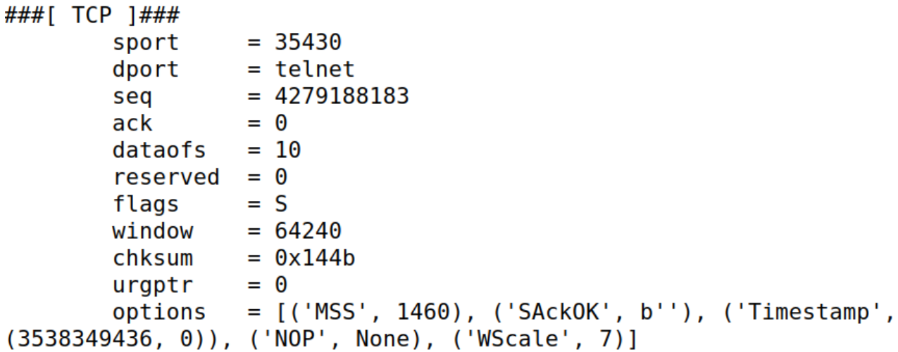

Para o nosso desafio final, tivemos de detetar todos os pacotes que chegavam ou iam para uma subnet específica que é uma subdivisão lógica de uma rede IP. Os computadores que pertencem à mesma subnet são endereçados com um grupo idêntico de bits mais significativos dos seus endereços IP.

O guia instruiu-nos a não escolher a subnet à qual a nossa máquina virtual estava ligada, por isso corremos novamente o ifconfig para descobrir outra que pudéssemos utilizar. Havia muitas para escolher, mas finalmente decidimos detetar pacotes que circulavam na subnet de "enp0s3".

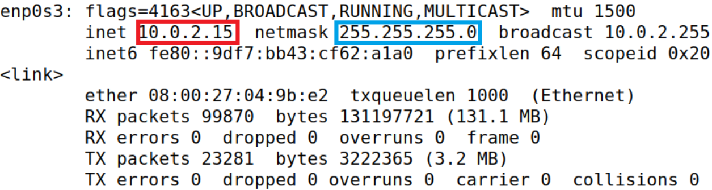

A subnet foi calculada aplicando a máscara de rede - 255.255.255.0 - à interface de rede - 10.0.2.15 - dando-nos 10.0.2.0/24. Então, nós modificamos o "sniffer.py" como mostrado abaixo:

```
filter = 'net 10.0.2.0/24'
pkt = sniff(iface='enp0s3', filter=filter, prn=print_pkt)
```

A rede de filtro especifica a subnet que o Scapy vai detetar.

## Task 1.2: Spoofing ICMP Packets

Nossa próxima tarefa tinha um objetivo muito específico: usar o Scapy para falsificar pacotes ICMP com um endereço IP de origem arbitrário. Além disso, tinham de ser pacotes de pedido de echo.

O guia mencionava que, se o nosso pedido fosse aceite pelo recetor, seria enviado um pacote de resposta echo para o endereço IP falsificado. Com essa informação em mente, criámos um novo script Python - "spoofer.py" - e seguimos os passos listados abaixo:

1. Criar um objeto da classe IP.

```
from scapy.all import *

ip = IP()
```

2. Alterar a origem e o destino do objeto IP.

```
ip.src = '10.9.0.5' # host A
ip.dst = '10.9.0.6' # host B
```

Por conveniência, decidimos que o nosso endereço IP arbitrário seria o do anfitrião A, uma vez que seria fácil de reconhecer.

3. Empilhar o objeto IP juntamente com um objeto de classe ICMP para formar um pacote.

```
packet = ip/ICMP()
```
Uma vez que o tipo predefinido de um objeto ICMP é o pedido de echo, que era o que pretendíamos, não precisávamos de o instanciar e modificar, pelo que nos limitámos a chamar o construtor.

4. Enviar o pacote.

```
send(packet)
```

Depois disso, tudo o que tínhamos de fazer era executar o script.

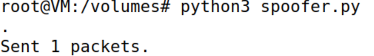

Para verificar se o nosso ataque tinha funcionado, decidimos detetar os pacotes que circulavam na interface de rede usando o Wireshark. Obtivemos os logs abaixo:

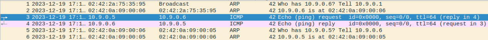

Uma vez que identificámos imediatamente o pacote de pedido - linha 3 - bem como a resposta correspondente - linha 4 - isso significa que o nosso ataque foi bem sucedido. Assim, graças ao spoofing, conseguimos fazer-nos passar pelo host A.


## Task 1.3 - Traceroute

Nesta tarefa, tivemos que implementar nossa própria versão do comando traceroute (comando do Linux que traça o caminho de um pacote IP até chegar ao seu destino) usando Scapy.

### Preparar o Script

Seguindo o tutorial fornecido pelo guia, criámos um novo script - "traceroute.py". O seu comportamento pode ser resumido da seguinte forma:

1. Criar um objeto IP, de modo a que o seu destino seja o endereço IP pretendido e o seu valor TTL seja 1.

```
import sys
from scapy.all import *

a = IP(dst=sys.argv[1], ttl=1)
# NOTE: sys.argv[0] -> program name
#       sys.argv[1] -> first argument
```

2. Crie um loop infinito, que será usado para incrementar o TTL. Nele, crie o pacote a ser enviado.

```
while True:
    packet = a / ICMP()
    ...
```

3. Utilizando sr1(), envia o pacote e recebe o primeiro pacote que é enviado como resposta.

```
reply = sr1(packet, timeout=1, verbose=0)
```

4. Verificar se a mensagem de erro ICMP foi recebida. Se tiver sido, incrementar o TTL e tentar novamente, caso contrário, sair do ciclo.

```
while True:
    ...

    # verify if the TTL was exceeded
    if reply == None or (reply[ICMP].type == 11 and reply[ICMP].code == 0):
        a.ttl += 1
        continue

    break
```

5. Imprime o valor do TTL que permite que o pacote chegue ao seu destino - a nossa distância.

```
print("Distance: ", a.ttl)
```

Below is the final script:

```
#!/usr/bin/env python3
import sys
from scapy.all import *

a = IP(dst=sys.argv[1], ttl=1)
# NOTE: sys.argv[0] -> program name
#       sys.argv[1] -> first argument

while True:
    packet = a / ICMP()
    reply = sr1(packet, timeout=1, verbose=0)
    
    # verify if the TTL was exceeded
    if reply == None or (reply[ICMP].type == 11 and reply[ICMP].code == 0): 
        a.ttl += 1
        continue

    break
    
print("Distance: ", a.ttl)
```

Para ter a certeza que o script estava a funcionar decidimos testar com o google como destino:

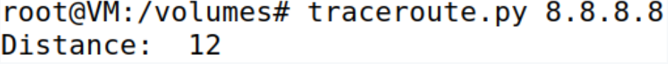

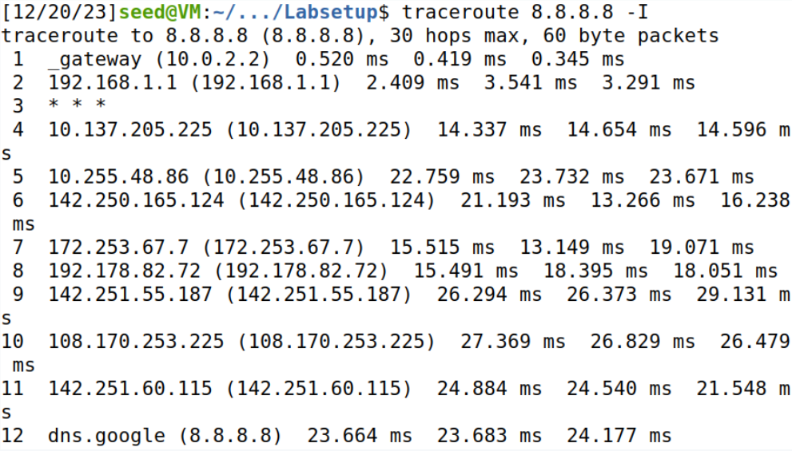

Considerando que as distâncias eram idênticas, o nosso programa estava a funcionar como esperado.

## Sniffing and then Spoofing

A nossa tarefa final consistia em criar um programa que combinasse as técnicas de sniffing e spoofing. O objetivo era simples: detetar todos os pacotes ICMP e, se o pacote fosse um pedido de echo ICMP, responder com um pacote de resposta de echo ICMP apropriado.

### Preparar o script

Para o efeito, criámos o nosso script final - "sniff-and-spoof.py" - que pode ser visto abaixo:

```
#!/usr/bin/env python3
from scapy.all import *

def send_reply(packet):
	if packet[ICMP].type != 8:
		return
		
	# criar o objeto IP
	ip = IP(src = packet[IP].dst, dst = packet[IP].src)
	
	# criar o objeto ICMP
	icmp = ICMP(type = 0, id = packet[ICMP].id, seq = packet[ICMP].seq)
	
	data = packet[Raw].load
		
	reply = ip / icmp / data
	send(reply, verbose = 0)

packet = sniff(iface='br-a0c2e1a6c461', filter='icmp', prn=send_reply)
```

O seu comportamento é apresentado sucintamente de seguida:

1. Detetar os pacotes ICMP na LAN e redireccioná-los para "send_reply()".

```
packet = sniff(iface='br-a0c2e1a6c461', filter='icmp', prn=send_reply)
```

2. Verifica se o pacote é um pedido de echo ICMP. Se não for, abandone a função, pois não estamos interessados neles.

```
if packet[ICMP].type != 8:
    return
```

3. Preparar a camada IP do pacote de resposta, criando um objeto IP.

```
# criar o objeto IP
ip = IP(src = packet[IP].dst, dst = packet[IP].src)
```

Como estávamos a fazer-nos passar pelo destino do pacote original, tivemos de trocar os endereços IP de origem e de destino.

4. Prepare a camada ICMP do pacote de resposta, criando um objeto ICMP.

```
# criar o objeto ICMP
icmp = ICMP(type = 0, id = packet[ICMP].id, seq = packet[ICMP].seq)
```

Foi necessário copiar os parâmetros id e seq do pacote original para que o nosso pacote falsificado não levantasse suspeitas. Em particular, era vital garantir que o número de sequência - seq - era igual ao do pacote original, porque uma discrepância no número de sequência poderia acionar medidas de segurança ou ser detectada pelo sistema.

5. Preparar os dados que serão enviados no pacote. Para evitar problemas que poderiam surgir se inventássemos dados, optámos por copiar simplesmente os dados do pacote original.

```
data = packet[Raw].load	
```

6. Criar o pacote de resposta juntando os objectos IP, ICMP e de dados. Depois, enviá-lo.

```	
reply = ip / icmp / data
send(reply, verbose = 0)
```

Para testar o nosso programa, o guia recomendava que usássemos uma das máquinas do utilizador - a máquina A (a nossa escolha) ou a máquina B - para enviar comandos ping para alguns endereços IP. Independentemente da existência ou não da máquina que recebeu o ping, o utilizador deveria receber uma resposta - os nossos pacotes falsificados.

O guia também fornecia alguns casos de teste, que decidimos usar. Para cada um deles, enviámos dois pings para o endereço IP: um em que o nosso programa não estava a correr e outro em que estava. Os resultados foram os seguintes:


Para o IP 1.2.3.4, obtivemos os seguintes resultados com e sem o programa, tendo sucesso com o programa:

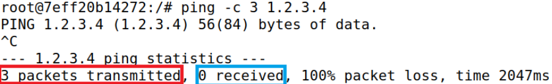

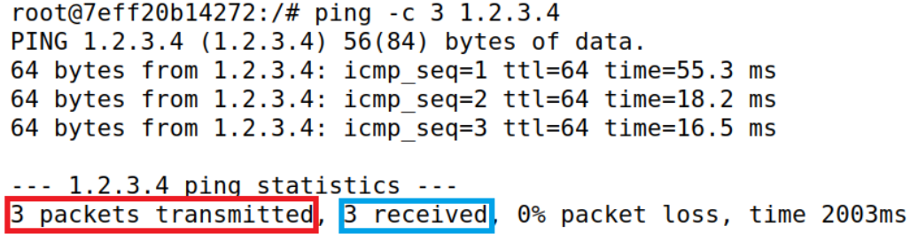

Para o IP 10.9.0.99, obtivemos os seguintes resultados com e sem o programa, não tendo sucesso com o programa:

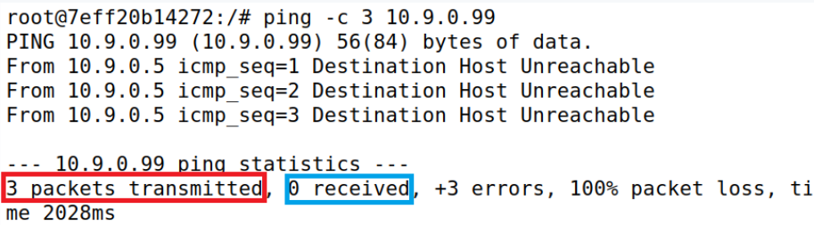

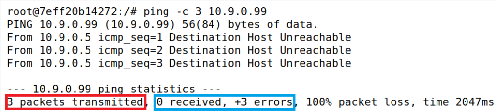

Para entender completamente os resultados dessa tarefa, primeiro tivemos que analisar o protocolo ARP.

Quando uma máquina tenta enviar pacotes para outra, primeiro procura o endereço MAC do destino. No entanto, se não o encontrar, envia um pacote de difusão para descobrir o endereço MAC do destinatário.

Tendo isso em mente, abaixo estão explicações muito sucintas para o resultado de cada caso de teste:

- 1.2.3.4

1.2.3.4 era o endereço IP de um host de Internet inexistente. A rota da máquina do utilizador até ele era a seguinte:

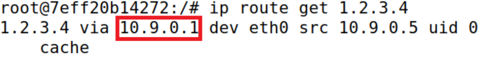

Isso significava que, para que os pacotes enviados pelo host A chegassem à Internet, eles tinham que passar primeiro pelo 10.9.0.1 - o atacante. De facto, ao analisar os registos do Wireshark, reparámos que foi enviado um pacote de difusão para obter o endereço MAC da máquina do atacante.

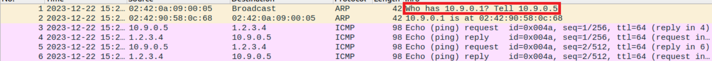

Assim, uma vez que o atacante iria redirecionar os pacotes de resposta do anfitrião, conseguimos falsificá-los.

- 10.9.0.99

10.9.0.99 era um anfitrião inexistente que pertencia à mesma LAN que o anfitrião A, como se pode deduzir do seu endereço IP. A rota que os ligava era a seguinte:

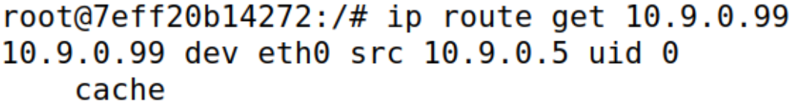

Ao contrário do que aconteceu com o 1.2.3.4, como esse host estaria localizado na mesma rede local, os pacotes enviados do host A não passaram pela máquina do invasor. De facto, o pacote de difusão que foi enviado desta vez não pedia o endereço MAC do atacante - pedia antes o do anfitrião inexistente.


# CTF
Começamos por explorar um pouco o ficheiro que nos foi dado no WireShark pois, ainda que já estejamos habituados à interface do software por causa da cadeira de RCOM, esta capture tinha algumas coisas que ainda não tinhamos visto noutras cadeias.

De seguida, fomos procurar o frame que continha o handshake com o número aleatório de '52362c11ff0ea3a000e1b48dc2d99e04c6d06ea1a061d5b8ddbf87b001745a27'. Encontramos como mostrado na seguinte print:


Depois procuramos o frame me que o handshake acabava. Neste frame também é possível ver o tamnho da mensagem encriptada que deu como terminado o processo do handshake.


Depois fomos procurar frames de transferência de *application data* para ver o tamanho da *application data* que era transferida.


Com estas informações já pudemos construir a flag, tendo a flag obtida sido:
```
flag{814-819-TLS_RSA_WITH_AES_128_CBC_SHA256-1264-80}
```


