# Trabalho realizado na Semana #4

## Task 1: Manipulating Environment Variables

 It was observed that the command `printenv` and `env` print on the command line the environment variables of the current running process and their respective values.
 
 It is also possible to print on the command line the value of specified environment variables by using `printev <variable_name>` or `env |grep <variable_name>`.
 
 By using the command `export <new_variable_name>=<new_variable_value>` , we can set a new environment variable on the current process. 
 To remove any environment variable we use the command `unset <variable name>`.

 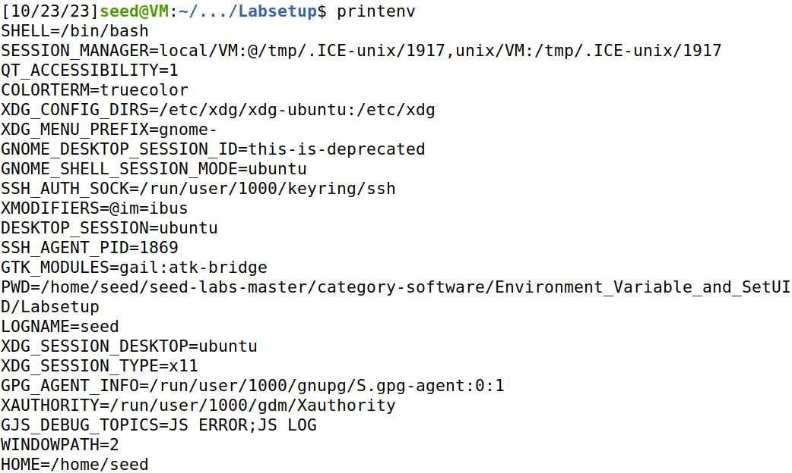

## Task 2: Passing Environment Variables from Parent Process to Child Process

 For this task we ran a program that prints the environment variables for 2 different processes, a parent process and his child process with the objective of comparing if their environment variables are different or if one process has more environment variables.

To accomplish that we stored the output of the program for the child process and then the parent process in diffent files, and compared the files with the `diff` command.
 
We observed that the child process inherited environment variables equal to the environment variables in the parent process, since both files have the same content.

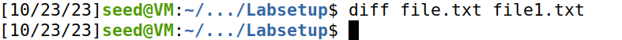

## Task 3: Environment Variables and execve()

For this task we ran the _myenv.c_ program 2 times. This program runs the command `execve` which takes 3 arguments, the name of the program to execute, a list of arguments and an environment. It is expected as the output the environment variables in which the new program is run. 
 
At first we passed the NULL value as the environment, so we didn't get any output.
 
By passing the global variable _environ_, which stores the environment of the calling process, the output generated is the same as the environment variables of the calling process.

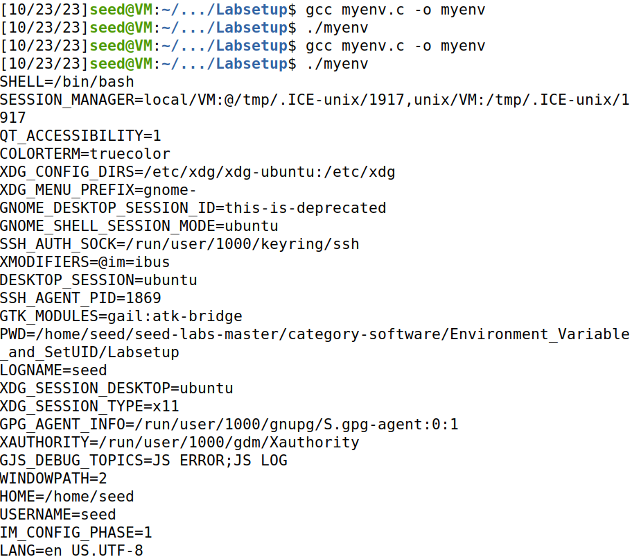
 
We observed that when a process runs a new program in itself, old environment variables will be lost unless they are passed by the calling process, this happens because the calling's process text,data,bss and stack are overwritten by that of the program loaded.

## Task 4: Environment Variables and system()

For this task we test if the `system()` function preserves the environment variables.

It is observed that the environment in which the program is run, has the same environment variables as of the calling process.

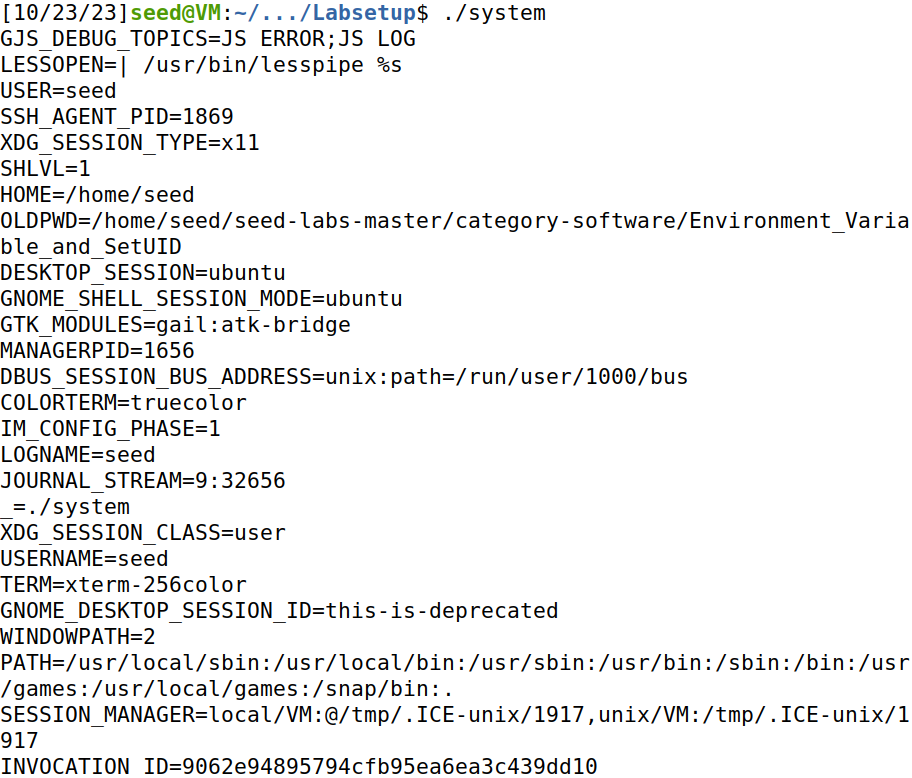

## Task 5: Environment Variable and Set-UID Programs

Task 5 introduced Set-UID, a special permission in Unix-based systems that allows certain programs to run with escalated privileges. 

To enhance security, the shell employs measures to prevent access to sensitive variables when executing with escalated privileges. 

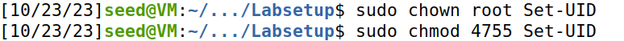

This safeguard aims to thwart the use of shared dynamic libraries, which could facilitate the execution of malicious code by altering their original paths.

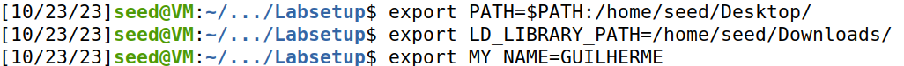

## Task 6: The PATH Environment Variable and Set-UID Programs

In Task 6, we created a Set-UID program that utilized the system("ls") command to invoke the Linux 'ls' command. 

Simultaneously, we crafted a malicious program named 'ls' and placed it in the directory '/home/seed/Desktop/Malicious'. To ensure the malicious 'ls' program ran instead of the system's 'ls', we modified the PATH environment variable with: 

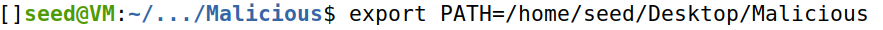

Subsequently, we verified that the executed 'ls' function was indeed the malicious one, overriding the system's default 'ls' command.

# CTF - Environment Variables and SET-UID

In this task, we were asked to connect to a server and find any vulnerabilities that could lead to the finding of the flag.

When we are prompted in the server, we are indetified as a user "nobody", in a read only file directory (flag_reader).

We were able to read the contents on the files "my_script.sh", "main.c" and "admin_note.txt".

Each file lead us to different conclusions:

1-"my_script.sh" : On this file we found out that the file "env" on the "flag_reader" folder is being called, and this file is linked to a file named "env" on the tmp folder. 

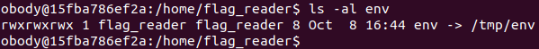

It also runs "printenv" withou giving any path to the desired file to run and the file "reader" on the "flag_reader" folder is executed.NOTE:This script is ran periodically on the server, and it exports environment variables defined on the file "/tmp/env".

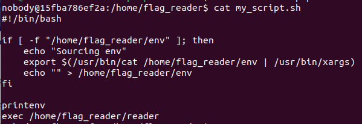

2-"main.c" : On this file we found out that there is a defined function "access" that receives 2 arguments (string, integer) being called. Since this function doesn't have the "access" function implementation, and considering that the output of the file reader is identical to what this file would output it was assumed that reader file is generated by compiling "main.c" file and using another file that has the "access" function implementation, which would work as a library.

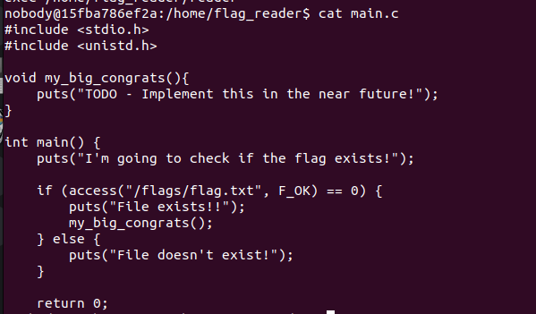

3-"admin_note.txt" : On this file we are given some hints. We are told that on the "tmp" folder there are some files which already where used to gain access to the flag content.

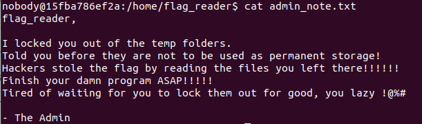

With all this information we then searched on the tmp folder, and we findout lots of .txt files, .c, .o and .so.

By reading the contents of one of the .c files, "new.c" we findout the implementation of the "access" function, which was printing the flag contents to a file called "bandeirinha.txt" and giving this file all permissions, which would allow us to print on it and to read it.

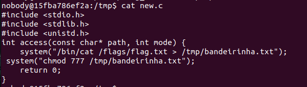

This file already had already been compiled into binary, in file "new.o" and linked into a shared library "libnew.so".

By giving the definition of the "access" function defined on the "new.c" file to the file "main.c" we would be able to write on the "bandeirinha.txt" file the contents stored on "/flags/flag.txt".

Since the "main.c" file doesn't have any include of a file with the "access" function, and this file depends on that function, we concluded that the function was defined in a library used by this file.

To take advantage of this we used the "LD_PRELOAD" environment variable, that preloads objects on the library defined as it's value.

Since we already that the script was exporting variables defined on the "/tmp/env" file, we wrote there the new value of the "LD_PRELOAD" variable, setting it to "/tmp/libnew.so", the library we wanted to use.

Now whenever the script would be run by the server this environment variable would be set, and the flag would be written into the "bandeirinha.txt".

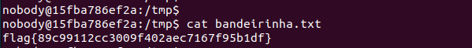

