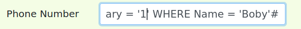

# TRABALHO REALIZADO NA SEMANA 8

## Setup
Inicialmente adicionamos a entrada : '10.9.0.5 www.seed-server.com' nos hosts da máquina virtual e abrimos um novo terminal com acesso à base de dados que vai ser usada durante os exercícios
```
$ sudo nano etc/hosts # Executámos este comando no dirétorio base da máquina

# Corremos os próximos comandos no diretório onde estiver o ficheiro docker-compose.yml

$ dcbuild 
$ dcup

$ dockps # Corremos este comando para verificar qual é o container do MySQL
$ docksh bb # Abrir o terminal do MySQL
$ mysql -u root -pdees # Executar o MySQL com utilizador root e a password dees
$ use sqllab_users; # Mudar para o schema indicado
```

## Task 1: Get Familiar with SQL Statements
A task era apenas utilizar uma querie para verificar os dados do user 'Alice'.


## Task 2: SQL Injection Attack on SELECT Statement
### Task 2.1 : Login in adminstrator mode from webpage
Acedemos ao site "www.seed-server.com" onde iriamos aceder à plataforma com os usuários. No snippet do ficheiro 'unsafe home.php' disponibilizado conseguimos ver que a query utilizada não é segura pois o comando é criado dinamicamente com as strings não sanitizadas escritas pelo utilizador.

Ao usarmos o input "admin'#" na caixa de input do username, conseguimos aceder sem necessidade de colocar a password, já que a verificação da password fica comentada pelo '#'. 


### Task 2.2 - Login in adminstrator mode from command line
Nesta task fizemos o ataque através da command line e de um pedido GET. Colocamos o input cifrado e obtivemos a seguinte linha :


O %27 siginifica uma ' e %23 significa uma #, é necessário utilizar estas conveções para poder utilizar caraters especiais num pedido.
Com isto conseguimos obter o código HTML da página que dispunha os todos os dados dos users da plataforma.

### Task 2.3 - Append a new SQL statement
Esta task consistia em tentar tornar um SQL statement em dois. Escolhemos mudar por exemplo o nome do user 'Alice'.
```
admin'; UPDATE credentials SET Name = 'NewAlice' WHERE ID = 1; #
```

Isto não foi possível e levou a um erro:


Foi nos indicado para ver no manual do sistema de SQL utilizado no guião onde neste link: https://www.php.net/manual/en/mysqli.quickstart.multiple-statement.php conseguimos ver que existe uma proteção ao uso de mais que uma query o que levou ao ataque não ser possível.

## Task 3: SQL Injection Attack on SELECT Statement
### Task 3.1: Modify your own salary.

Após fazer login na conta da Alice (colocando no username Alice'#), conseguimos aceder à página para edição dos dados do user. 
O ataque consistui em colocarmos no input do numero de telemóvel o seguinte código para alterar o salário do user para 600000:


### Task 3.2 - Modify other people’ salary

O objetivo desta task era alterar o salário de outro user mudando apenas um pormenor em realção à tecnica anterior. A diferença foi em colocar uma clause WHERE em que específicamos o user que queremos alterar o salário e comentar o resto que segue.



Podemos ver que foi alterado então o salário do Boby:


### Task 3.3 - Modify other people’ password

O objetivo desta task era alterar a password de outro user. Para isto utilizamos os código anteriormente utilizado apenas adicionando a clause 'password' que é cifrado antes com criptografia SHA1. A password que criei é 'l10g08' em que a hash é 'd2b47f0d3f18e746009d3cb97e79e6e39c1e1484'.

```
925367899', password='d2b47f0d3f18e746009d3cb97e79e6e39c1e1484' WHERE name='Boby'#
```

Conseguimos assim entrar na conta do Boby utlizando a nova password que se consegue ver no url da página:


# CTF

Primeiramente começamos por avaliar o código da query, para localizarmos alguma falha de segurança, e deparamo-nos com falta de sanitização dos inputs, permitindo ataque de *sql injection*.

Para dar login como admin usamos:
- username: admin';# 
- password: # (pode ser random)

Outra abordagem para resolver o mesmo problema seria com as credenciais:
- username: admin'--
- password: # (pode ser random)

Em teoria a password até puderia estar vazia, mas como não é permitido login sem password então optamos por meter um comment também.     


*O visual do site encontra-se altrerado devido à print ter sido tirada com dark mode ativado*

Deste modo obtemos a flag e concluímos o ctf.


